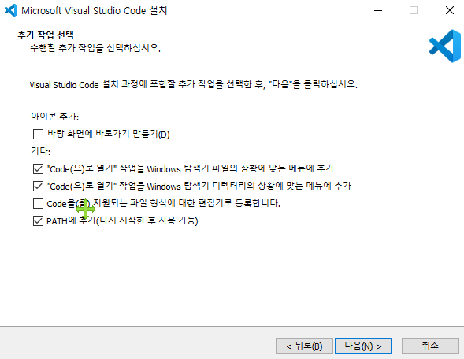
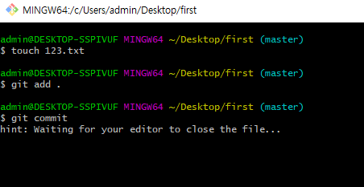
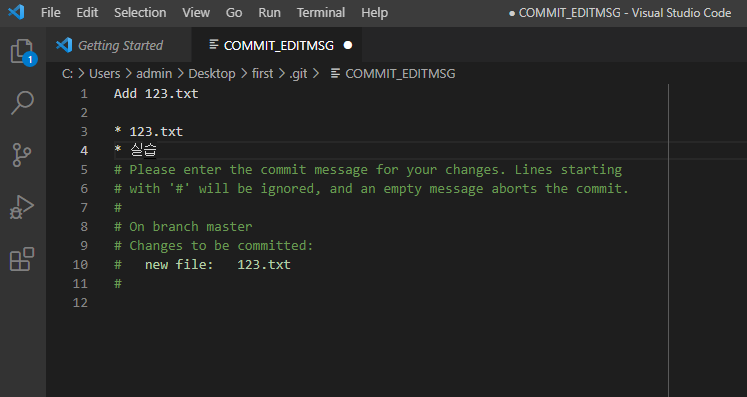
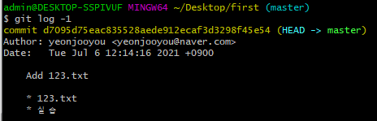
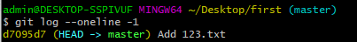

# gitconfig

> Git 설정 파일

시스템, 글로벌, 로컬 설정을 각기 다르게 할 수 있으나 global 설정을 기본으로 설정

추후 프로젝트별로 다른 설정을 하고 싶다면 옵션을 `--global` 대신 `--local` 로 하면 된다.


## Global

> ~/.gitconfig 파일에 기록된 설정들

```bash
# 현재 설정 알아보기
$ git config --global -l
user.email=yeonjooyou@naver.com
user.name=yeonjooyou
credential.provider=generic
```

```bash
$ code --help
Visual Studio Code 1.57.1

Usage: code.exe [options][paths...]

To read output from another program, append '-' (e.g. 'echo Hello World | code.exe -')

Options
  -d --diff <file> <file>           Compare two files with each other.
  -a --add <folder>                 Add folder(s) to the last active window.
  -g --goto <file:line[:character]> Open a file at the path on the specified
                                    line and character position.
  -n --new-window                   Force to open a new window.
  -r --reuse-window                 Force to open a file or folder in an
                                    already opened window.
  -w --wait                         Wait for the files to be closed before
                                    returning.
  --locale <locale>                 The locale to use (e.g. en-US or zh-TW).
  --user-data-dir <dir>             Specifies the directory that user data is
                                    kept in. Can be used to open multiple
                                    distinct instances of Code.
  -h --help                         Print usage.

Extensions Management
  --extensions-dir <dir>
      Set the root path for extensions.
  --list-extensions
      List the installed extensions.
  --show-versions
      Show versions of installed extensions, when using --list-extensions.
  --category <category>
      Filters installed extensions by provided category, when using --list-extensions.
  --install-extension <extension-id[@version] | path-to-vsix>
      Installs or updates the extension. The identifier of an extension is always `${publisher}.${name}`. Use `--force` argument to update to latest version. To install a specific version provide `@${version}`. For example: 'vscode.csharp@1.2.3'.
  --uninstall-extension <extension-id>
      Uninstalls an extension.
  --enable-proposed-api <extension-id>
      Enables proposed API features for extensions. Can receive one or more extension IDs to enable individually.

Troubleshooting
  -v --version                       Print version.
  --verbose                          Print verbose output (implies --wait).
  --log <level>                      Log level to use. Default is 'info'.
                                     Allowed values are 'critical', 'error',
                                     'warn', 'info', 'debug', 'trace', 'off'.
  -s --status                        Print process usage and diagnostics
                                     information.
  --prof-startup                     Run CPU profiler during startup.
  --disable-extensions               Disable all installed extensions.
  --disable-extension <extension-id> Disable an extension.
  --sync <on> <off>                  Turn sync on or off.
  --inspect-extensions <port>        Allow debugging and profiling of
                                     extensions. Check the developer tools for
                                     the connection URI.
  --inspect-brk-extensions <port>    Allow debugging and profiling of
                                     extensions with the extension host being
                                     paused after start. Check the developer
                                     tools for the connection URI.
  --disable-gpu                      Disable GPU hardware acceleration.
  --max-memory <memory>              Max memory size for a window (in Mbytes).
  --telemetry                        Shows all telemetry events which VS code
                                     collects.
                                     
```

```bash
$ git config --global core.editor "code --wait"

$ git config --global -l
user.email=yeonjooyou@naver.com
user.name=yeonjooyou
credential.provider=generic
core.editor=code --wait
```


#### 필수

##### user 정보

Commit시 Author로 기록되기 위해서 초기에 설정할 필요가 있다.

```bash
$ git config --global user.email "yeonjooyou.com"
$ git config --global user.name "yeonjooyou"
```


#### 선택

##### credential (Github 인증 등)

```bash
$ git config --global credential.provider generic
```

* 현재 git bash 2.32에 발생된 버그를 해결하기 위함


##### 커밋 에디터 설정

> 기존 vim에서 vs code로 변경

```bash
$ git config --global core.editor "code --wait"
```


> visual studio code 설치




> 오류 해결 과정









