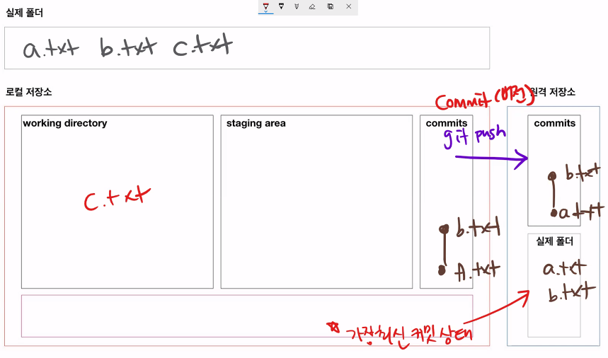

## 원격저장소(remote repository) 활용

> 원격저장소를 제공해주는 서비스 중에 GitHub를 활용

### 원격저장소 등록

```bash
$ git remote add origin <주소>
```

```bash
# 예시
$ git remote add origin https://github.com/yeonjooyou/first.git
```

* 깃아(git), 원격저장소(remote)에 추가(add) 해줘. `origin` 이라는 이름으로 <주소>를
  * 비조뒤일앞 / 깃 원 추

### 원격저장소 조회

```bash
$ git remote -v
origin  https://github.com/yeonjooyou/first.git (fetch)
origin  https://github.com/yeonjooyou/first.git (push)
```

### 원격저장소 삭제

```bash
$ git remote rm origin
```

* 깃아(git), 원격저장소(remote)에 삭제(rm) 할게. `origin` 을.

### push

```bash
$ git push origin master
```

* 깃아(git), push할게. `origin` 의 master로.
* 커밋 내역을 push 함.
  *  현재 폴더의 파일들을 업로드 하는 개념이 아님!!



