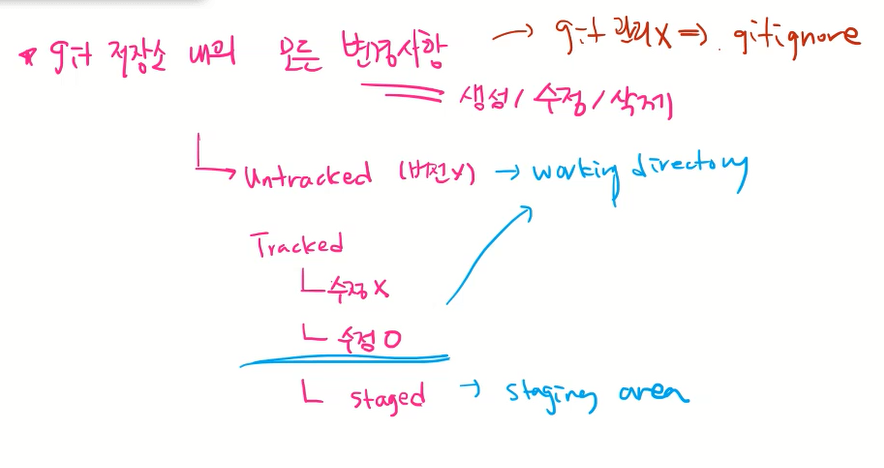

# undoing

## 1. add 취소

### 첫번째

```bash
$ git status
On branch master
No commits yet
Changes to be committed:
	# unstage 위해서..
	# git rm --cached <file>
  (use "git rm --cached <file>..." to unstage)
        new file:   README.md
        new file:   a.txt
```

```bash
$ git rm --cached a.txt
$ git status
On branch master
No commits yet
Changes to be committed:
  (use "git rm --cached <file>..." to unstage)
        new file:   README.md
Untracked files:
  (use "git add <file>..." to include in what will be committed)
        a.txt
```

### 두번째

```bash
$ git status
On branch master
Changes to be committed:
  (use "git restore --staged <file>..." to unstage)
        modified:   README.md
        modified:   a.txt
```

```bash
$ git restore --staged a.txt
$ git status
On branch master
Changes to be committed:
  (use "git restore --staged <file>..." to unstage)
        modified:   README.md
Changes not staged for commit:
  (use "git add <file>..." to update what will be committed)
  (use "git restore <file>..." to discard changes in working directory)
        modified:   a.txt
```

### 첫번째 두번째 다른 이유

> untracked vs changes not staged for commit
```bash
$ git status
On branch master
Changes to be committed:
  (use "git restore --staged <file>..." to unstage)
        modified:   README.md
# 변경사항인데
# staged가 아닌 애들 (WD O)
Changes not staged for commit:
  (use "git add <file>..." to update what will be committed)
  (use "git restore <file>..." to discard changes in working directory)
        modified:   a.txt
# untracked 파일들 (WD O)
Untracked files:
  (use "git add <file>..." to include in what will be committed)
        sori.txt
```

## 2. Working directory 

> 작업 내용을 이전 버전 상태로 되돌리고 싶을 때
> 주의!!!! 해당 명령어를 실행한 이후 절대로 다시 복원 불가능!!!
```bash
$ git status
On branch master
Changes not staged for commit:
  (use "git add <file>..." to update what will be committed)
  # 변경사항을 버리기 위해서는...
  # WD 있는거..
  (use "git restore <file>..." to discard changes in working directory)
        modified:   a.txt
no changes added to commit (use "git add" and/or "git commit -a")
```

```bash
$ git restore a.txt
```


## 3. 커밋 메시지 수정

> 공개된 저장소에 push 된 커밋은 절대 메시지 수정하지 말라!
>
> => 커밋 해시값이 변경되기 때문에
```bash
$ git commit -m 'Adddd no.txt'
[master 7a81b6c] Adddd no.txt
 1 file changed, 0 insertions(+), 0 deletions(-)
 create mode 100644 no.txt
$ git commit --amend
hint: Waiting for your editor to close the file..[master c01f908] Add no.txt
 Date: Fri Jun 4 17:21:43 2021 +0900
 1 file changed, 0 insertions(+), 0 deletions(-)
 create mode 100644 no.txt
```

* visual studio code나 vim 등 커밋 메시지 작성 화면이 나온다.
* 여기에서 수정하고 저장하면 반영된다.

### 빠진 파일을 추가 커밋할 때..

```bash
student@M503INS MINGW64 ~/Desktop/last (master)
$ git status
On branch master
Changes to be committed:
  (use "git restore --staged <file>..." to unstage)
        new file:   real.txt
Untracked files:
  (use "git add <file>..." to include in what will be committed)
        omit.txt
student@M503INS MINGW64 ~/Desktop/last (master)
$ git commit -m 'omit & real'
[master ce16ecb] omit & real
 1 file changed, 0 insertions(+), 0 deletions(-)
 create mode 100644 real.txt
student@M503INS MINGW64 ~/Desktop/last (master)
$ git status
On branch master
Untracked files:
  (use "git add <file>..." to include in what will be committed)
        omit.txt
nothing added to commit but untracked files present (use "git add" to track)
```

#### 해결!!

```bash
$ git add .
$ git status
On branch master
Changes to be committed:
  (use "git restore --staged <file>..." to unstage)
        new file:   omit.txt
$ git commit --amend
hint: Waiting for your editor to close the file..[master ce77c2d] omit & real
 Date: Fri Jun 4 17:29:22 2021 +0900
 2 files changed, 0 insertions(+), 0 deletions(-)
 create mode 100644 omit.txt
 create mode 100644 real.txt
```


## git 저장소 내의 모든 변경사항

