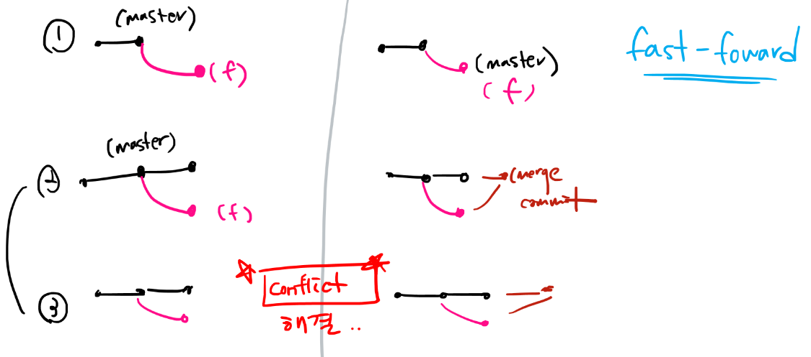

# Git/Github 특강 마지막 정리

0. 비어있는 파일을 만들기 위한 bash 명령어는?

```bash
touch
```

> `touch` 는 윈도우에 하는 것 즉, 기본 명령어이다. git에 하는 것이 아니다. git 관련된 명령어는 앞에 `git` 이 붙는다.


1. Git 원격저장소의 url이 [https://google.com](https://www.google.com/url?q=https://google.com&sa=D&source=editors&ust=1625560742908000&usg=AFQjCNF3LlkC7CK4x1BHwXcKREh01bAhmA) 일때 원격저장소로 설정하기 위한 명령어는?

```bash
$ git remote add origin https://google.com
```


2. 다음의 오류 메시지의 발생 원인은 무엇인가?


> git init을 하지 않았기 때문이다.(fatal: not a git repository)
>
> 즉 git 프로젝트가 아닌 곳에서 명령을 하면 발생하는 오류이다.


3. 다음 중 커밋을 할 시점으로 적절하지 않을 것을 모두 고르시오.

- [ ] 모든 기능 개발이 완성 되었을 때

- [ ] 모든 기능 중 일부 기능만 완성 하였을 때

- [x] 작업을 하던 중 식사하러 갈 때

- [x] 작업을 하던 중 기능 개발은 완성 안되었지만 긴급하게 작업해야 할 때


4. git 저장소 내에서 특정 파일/폴더 등을 git으로 관리하고 싶지 않을 때 사용하는 파일은?

> . gitignore


5. push를 했을 때 원격저장소에 반영되는 것은?

> 버전
>
> 즉 파일이나 폴더가 아니라 `commit` 을 `push` 하는 것이다.


6. 다음 오류 메시지가 발생하였을 때 해결하기 위한 명령어들을 순서대로 작성하시오.


```bash
$ git pull origin master
$ git add .
$ git commit -m '<메시지>'
$ git push origin master
```


6-1. 위의 상황의 이유를 알기 위해 로컬에서 작성해야하는 명령어를 쓰시오.

```bash
$ git log --oneline
```

> `push` 는 `commit` 과 관련된 것이므로, `commit` 과 관련된 `log`를 명령어로 입력하는 것이 적절하다.


7. clone과 pull 명령어의 차이점을 쓰시오.

|                            clone                             |                             pull                             |
| :----------------------------------------------------------: | :----------------------------------------------------------: |
| init과 비교해서 생각한다. `init` 은 내가 직접 저장소(신규 git 저장소)를 만드려고 할 때, pull 을 한다. `clone` 은 외부에 있는 저장소(기존 프로젝트)를 가져오려면, clone을 한다. | push와 비교해서 생각한다. `push` 는 기존에 내가 작업했던 commit들을 원격저장소에 보내는 작업이다. `pull` 은 원격저장소에 있는 변경사항들 즉, commit들을 내가 가지고 와서 병합시키기 위해 하는 작업이다. |


8. 로컬에서 브랜치를 merge하면서 충돌(conflict)가 발생하였을 때 충돌난 파일 목록을 확인하기 위해 작성해야하는 명령어를 쓰시오.

```bash
$ git status
```

> 충돌난 파일들의 목록들을 WD(working directory)에 충돌났다고 boss modify라고 쭉 나와있을 것이다. 즉 충돌된 파일들의 목록을 확인하기 위해서는 `status` 로 확인한다.


9. 다음의 메시지가 발생하는 이유는?


> nothing to commit (커밋할 것이 없다.)


9-1. 상황을 보기 위해 어떤 명령어를 입력해야하는지 쓰시오.

```bash
$ git status
```


10. 다음의 메시지가 발생하는 이유는?


> nothing to commit (커밋할 것이 없다.)


10-1. 상황을 보기 위해 어떤 명령어를 입력해야하는지 쓰시오.

```bash
$ git log --oneline
```


11. Github flow에서 Shared Repository와 Fork 모델의 가장 큰 차이점은?

> push 권한(permission) 여부, 즉 자신이 `collaborator` 로 등록이 되어있는지 안되어있는지이다.


# git 명령어


# 협력 상황


