# Git bash 설치하기 (Windows)

*macOS에는 기본적으로 설치되어 있습니다.*


### 설치(Git 2.32.0)

1. 다운로드

   1. 처음 설치하는 경우

      https://git-scm.com/download/win 로 이동 ⇒ 바로 다운로드 시작

   2. 이미 설치하는 경우

      이미 Git을 설치했다면, 업데이트를 진행한다. 명령 프롬프트 `cmd` 혹은 `git bash` 에서 아래와 같이 입력한다.

      ```bash
      $ git update-git-for-windows
      ```

      이후 아래 페이지를 따라 진행한다. (없는 화면이 있을 수 있다.)


### 설치과정

1. 다음

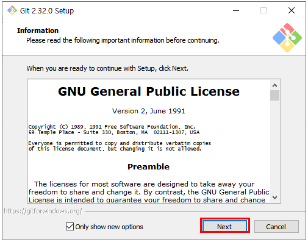

2. 다음(**임의로 설치 위치 수정 X !!**)

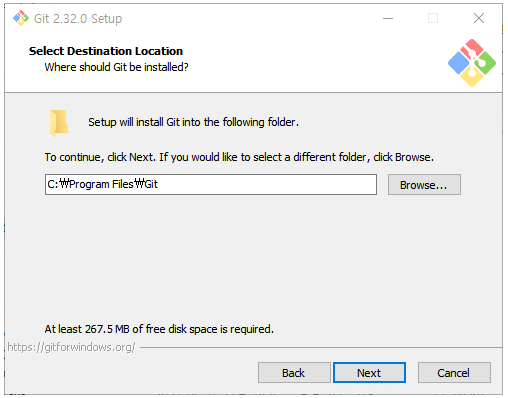

3. 다음(기존 설정 그대로)

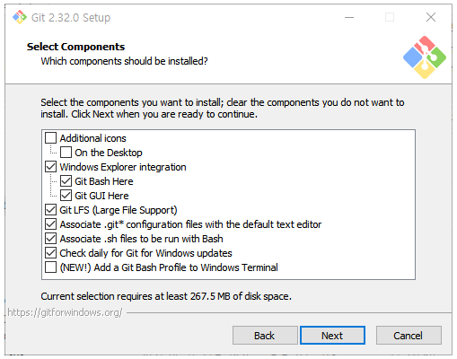

4. 다음

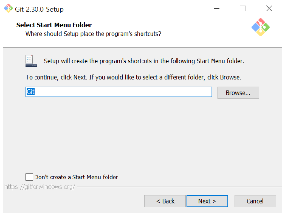

5. 다음

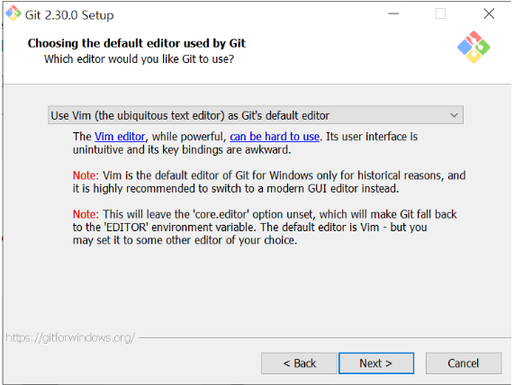

6. 다음

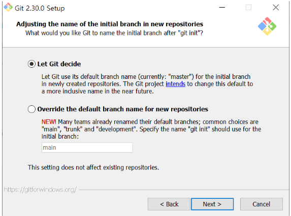

7. **2번 체크** -> 다음

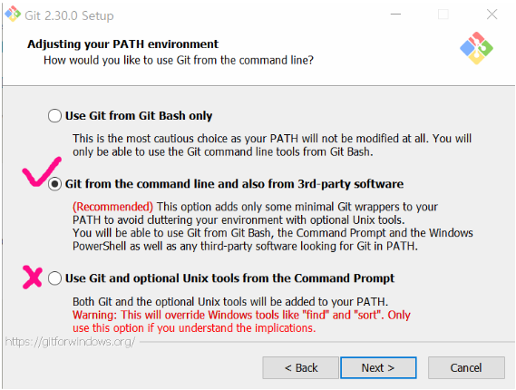

8. 다음

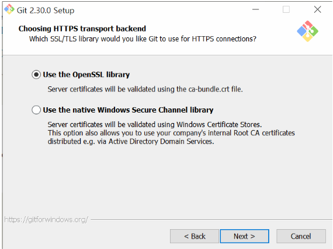

9. 다음

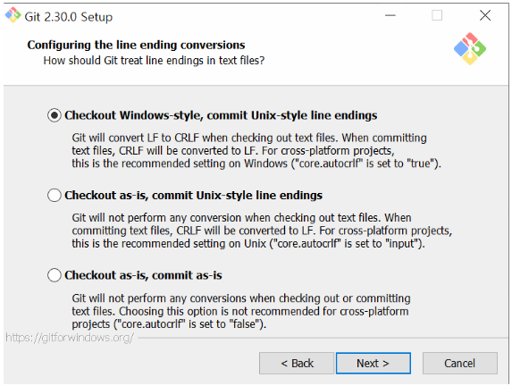

10. 다음

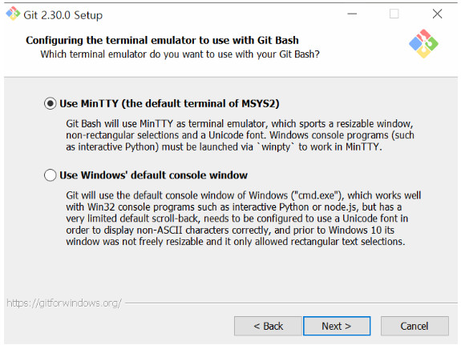

11. 다음


12. 다음

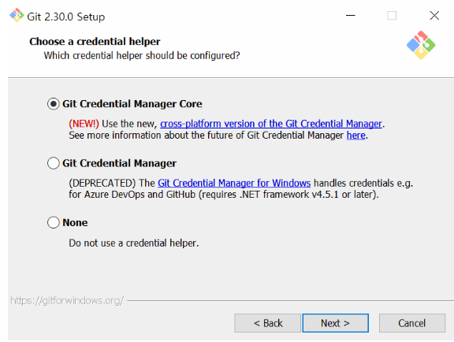

13. 다음

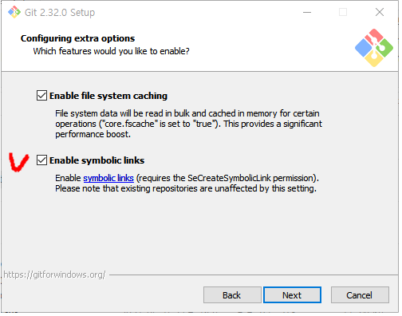

14. 다음(설치 시작)

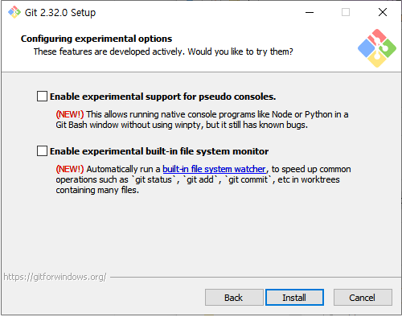

15. 설치 진행

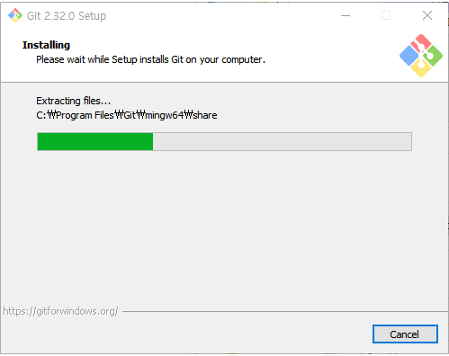

16. 릴리즈 노트 확인 체크해제 -> 종료

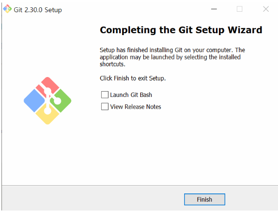

17. 새로운 폴더 생성 후 오른쪽 마우스 클릭 시 `Git Bash Here` 가 잘 뜬다면, 설치 완료!!

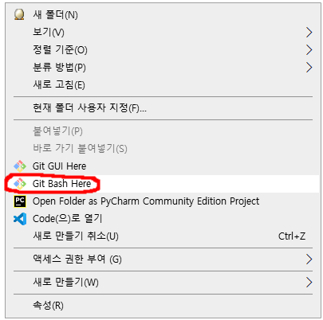