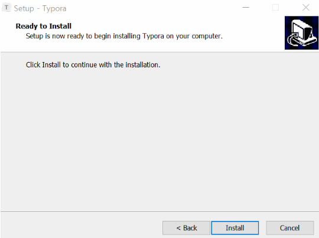

# Typora

> 개발자들의 문서 마크다운(Markdown `.md`) 편집을 위한 마크다운 편집기 Typora를 설치한다.

1. https://typora.io/#windows 로 이동하여 본인 컴퓨터에 맞는 버전(32bit/64bit) 다운로드

2. 설치

   1. User for all 선택
   2. 바탕화면 바로가기 만들기 선택(자유) 후 다음

   

   3. 설치 시작

   

   4. 완료 후 실행 -> 종료

   

* 윈도우의 컨텍스트 메뉴 새로만들기에 Markdown파일을 추가하고 싶은 경우

  https://mangkyu.tistory.com/80 를 참고

