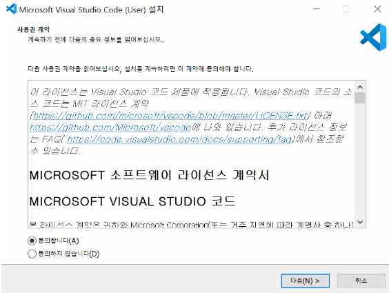
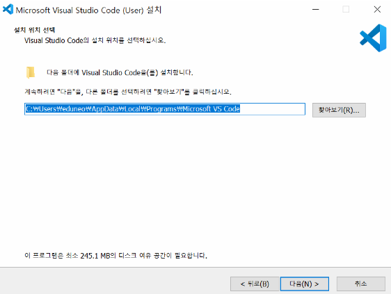
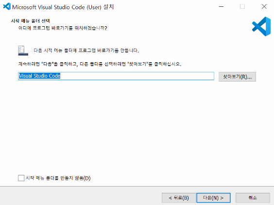
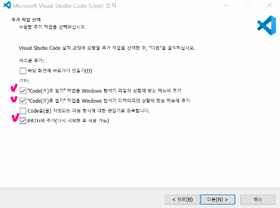
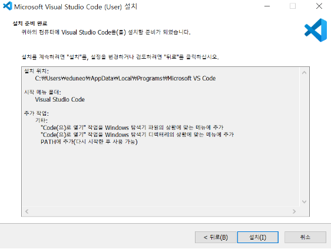
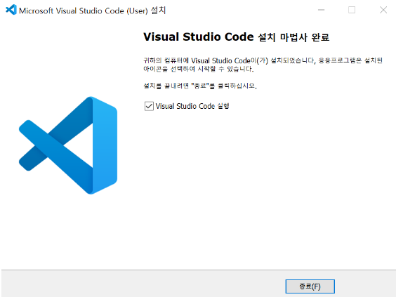

# VS Code

> 코드 편집을 위해 VS Code를 설치한다.
>
> 이미 설치되어 있어도, 설치 단계에서 설정이 다를 수 있으므로 재설치를 권장한다.

### VS Code 설치

1. https://code.visualstudio.com/docs/?dv=win 로 이동 ⇒ 바로 다운로드 시작.
2. 설치
3. 동의 후 다음

4. 다음

5. 다음

6. 총 5개의 체크박스 중 **2, 3, 5번** 체크 후 다음

7. 설치

8. 종료 및 실행

