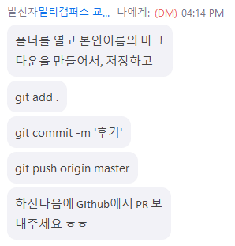

# 후기

> 융복합 프로젝트형 빅데이터 분석 서비스 개발 github 특강 - 210706
## Fork & PR

1. 먼저 해당 저장소를 fork

2. 포크한 본인 저장소를 clone

  * edutak이 주소에 있으면 안된다..

    ```bash
    $ git clone _____________
    ```

3. 후기를 작성할 때 본인 이름의 마크다운 파일을 만들어주세요.

  * 내용은 비어있어도됨.

  * 반드시 마크다운 파일을 만들고 저장!!!!!!!

4. 커밋 !

5. push 

   ```bash
   $ git push origin master
   ```

6. Pull request를 만든다! Github 들어와서


#### 실습내용

```bash
$ git clone https://github.com/yeonjooyou/github-210706.git
Cloning into 'github-210706'...
remote: Enumerating objects: 6, done.
remote: Counting objects: 100% (6/6), done.
remote: Compressing objects: 100% (4/4), done.
remote: Total 6 (delta 0), reused 0 (delta 0), pack-reused 0
Receiving objects: 100% (6/6), done.
```





```bash
admin@DESKTOP-SSPIVUF MINGW64 ~/Desktop/github-210706 (master)
$ git add .

admin@DESKTOP-SSPIVUF MINGW64 ~/Desktop/github-210706 (master)
$ git commit -m '후기'
[master fef7829] 후기
 1 file changed, 1 insertion(+)
 create mode 100644 "\354\234\240\354\227\260\354\243\274.md"

admin@DESKTOP-SSPIVUF MINGW64 ~/Desktop/github-210706 (master)
$ git push origin master
Enumerating objects: 4, done.
Counting objects: 100% (4/4), done.
Delta compression using up to 2 threads
Compressing objects: 100% (3/3), done.
Writing objects: 100% (3/3), 340 bytes | 340.00 KiB/s, done.
Total 3 (delta 0), reused 0 (delta 0), pack-reused 0
To https://github.com/yeonjooyou/github-210706.git
   933e0e0..fef7829  master -> master

admin@DESKTOP-SSPIVUF MINGW64 ~/Desktop/github-210706 (master)
$
```


[후기모음](https://github.com/edutak/github-210706/pulls)

