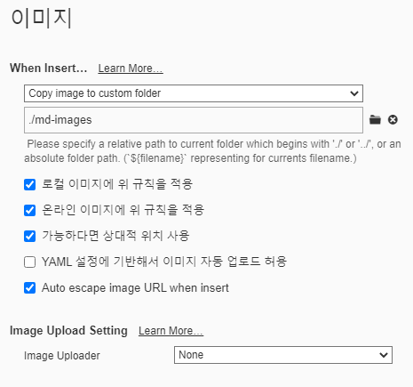

# 마크다운 문법

## 제목(heading)

#제목(heading)

문서의 구조를 잡기 위한 제목은 #을 통해 표현한다. #의 갯수로 제목의 레벨을 지정한다.

### 제목3

#### 제목 4

##### 제목 5

###### 제목 6


## 목록(list)

목록은 순서가 있는 목록과 순서가 없는 목록으로 구분된다.

1. 목록1
2. 목록2
   1. 목록 2-1
   2. 목록 2-2
3. shift + tab

* 순서가 없는 목록
  * tab 하면 하위로/ * 


## 코드 블록

코드를 작성할 때 코드 블록을 활용하면, 언어별 syntax highlighting 기능이 제공된다.

``` python
# 짝수 판별 조건식
num = 10
if num % 2 == 0 :
    print('짝수')
```

``` html
<!-- Html 주석 -->
<h1>
    안녕하세요.
</h1>
```

```bash
$ git init 
```

마크다운 문법이 어떻게 보이는지 바로 보인다. </> 문법(raw)


## 인라인 코드블록

`if` 는 파이썬 조건문에서 활용되는 키워드입니다.

변수명을 보통 활용한다.


## 표

| 이름   | 나이 | 비고 |
| ------ | ---- | ---- |
| 홍길동 | 20   |      |
| 김철수 | 24   |      |
| 최영희 | 25   |      |

(Typora 기능 이용) 본문 > 표 > 표 삽입


## 이미지


* typora에 아래와  같이 설정하면, 상대 경로로 쉽게 이미지 파일을 관리할 수 있다.

설정 > 환경설정 >...



 


## 링크

[구글](https://google.com)


## 인용문

> 인용문은 >를 통해 만든다.
>
> 한줄 정의를 할 때 사용


## 기타

**굵게(볼드체)**

*기울임(이탤릭체)*

~~취소선~~

