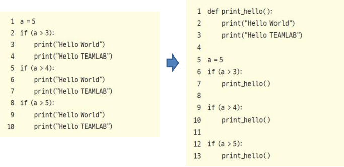
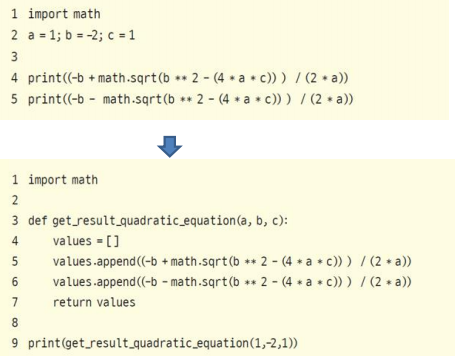

# 좋은 코드 작성 방법

## 좋은 코드의 의미

* 프로그래밍은 팀플레이(team play)이다.
* 가독성 좋은 코드를 작성하기 위해서는 여러 가지 필요하지만, 일단 여러 사람의 이해를 돕기 위한 규칙이 필요하다. 프로그래밍에서 이 규칙을 일반적으로 코딩 규칙(coding convention)이라고 한다.

## 코딩 규칙

* 들여쓰기는 4 space
* 한 줄은 최대 79자까지
* 불필요한 공백은 피함
* PEP 8 (Python Enhance Proposal 8) : 파이썬 개발자들이 앞으로 필요한 파이썬의 기능이나 여러 가지 부수적인 것을 정의한 문서이다.
  * = 연산자는 1칸 이상 띄우지 않는다.
  * 주석은 항상 갱신하고, 불필요한 주석은 삭제한다.
  * 소문자 l, 대문자 O, 대문자 I는 사용을 금한다.
  * 함수명은 소문자로 구성하고, 필요하면 밑줄로 나눈다.

## 함수 개발 가이드라인

### 함수이름

* 함수는 가능하면 짧게 작성할 것(줄 수를 줄일 것)
* 함수 이름에 함수의 역할과 의도를 명확히 드러낼 것

### 함수의 역할

* 함수는 한 가지 역할을 명확히 해야 한다.
* 이름에 맞는 최소한의 역할을 할 수 있도록 작성해야 한다.

### 함수를 만드는 경우

* 공통으로 사용되는 코드를 함수로 반환

* 복잡한 로직이 사용되었을 때, 식별 가능한 이름의 함수로 변환

