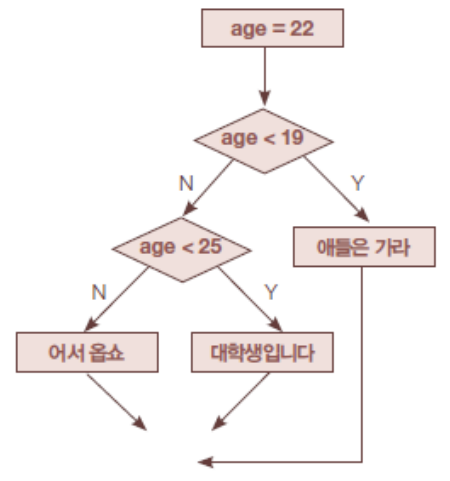

# if 문

> if 조건식 :
>     코드블럭

* 조건식 : 연산 결과가 bool 타입(True/False)이 되는 식
  * ​         비교연산자(==,!=,>,<,>=,<=,...)
  * ​         논리연산자(and, or, not)
  * ​         bool 타입으로 인식 가능한 변수 또는 리터럴

```python
if True :
	falg = True
    
if flag == True :
    
if flag :
```


### elif문

> else if
>
> if else문에서 조건을 만족하지 않을 때 세부 조건을 추가 점검

```python
age = 23
if age < 19 :
    print("애들은 가라.")
elif age < 25 :
    print("대학생 입니다.")
else :
    print("어서 옵쇼.")
```




> if 비교식 :
>    xxxxx

> if not 비교식 :
>    xxxxx
