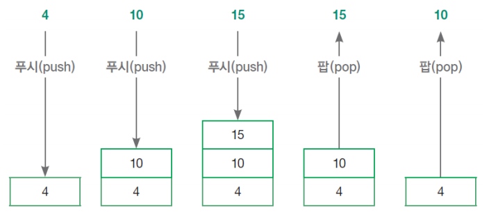
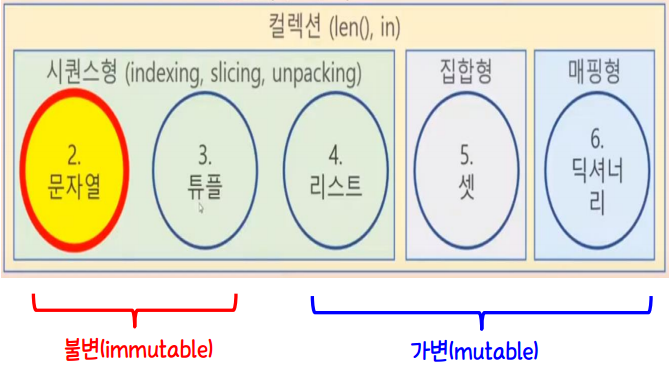
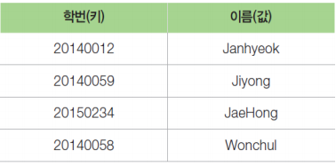
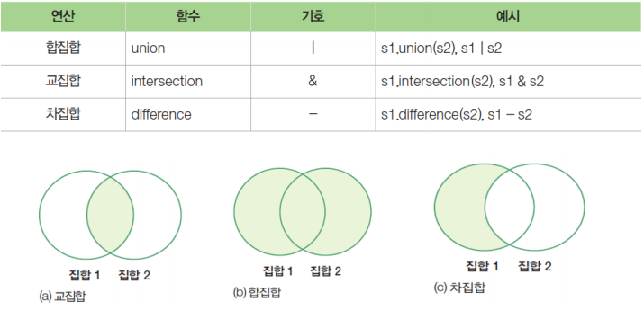

# 자료구조(data structure)

> 데이터를 관리하는 방식
>
> *가장 많이 사용하는 자료구조: 리스트, 딕셔너리*

> * 리스트
>   * 스택(stack): 나중에 들어온 값을 먼저 나갈 수 있도록 해주는 자료구조(last in first out)
>   * 큐(queue): 먼저 들어온 값을 먼저 나갈 수 있도록 해주는 자료구조(first in first out)
> * 튜플(tuple): 리스트와 같지만, 데이터의 변경을 허용하지 않는 자료구조
> * 세트(set): 데이터의 중복을 허용하지 않고, 수학의 집합 연산을 지원하는 자료구조
> * 딕셔너리(dictionary): 전화번호부와 같이 키(key)와 값(value) 형태의 데이터를 저장하는 자료구조, 여기서 키 값은 다른 데이터와 중복을 허용하지 않음
> * collections 모듈: 위에 열거된 여러 자료구조를 효율적으로 사용할 수 있도록 지원하는 파이썬 내장(built-in) 모듈


## 스택(stack)

* 스택(stack) : 자료구조의 핵심 개념 중 하나로, 'Last In First Out(LIFO)'으로 정의할 수 있다.
* 마지막에 들어간 데이터가 가장 먼저 나오는 형태로, 데이터의 저장 공간을 구현하는 것이다.
* 데이터를 저장하는 공간으로, 리스트와 비슷하지만 저장과 꺼내는 순서가 바뀌는 형태를 스택 자료구조(stack data structure)라고 한다.
* 스택에서 데이터를 저장하는 것을 푸시(push), 데이터를 추출하는 것을 팝(pop)이라고 한다.



* 파이썬에서는 리스트를 사용하여 스택을 구현할 수 있다.
* 리스트라는 저장 공간을 만든 후, append() 함수로 데이터를 저장(push)하고 추출(pop)한다.

```python
a = [1, 2, 3, 4, 5]
a.append(10) # a = [1, 2, 3, 4, 5, 10]
a.pop() # 20
```


## 큐(queue)

* 큐(queue) : 먼저 들어간 데이터가 먼저 나오는 'First In First Out(FIFO)'의 메모리 구조를 가지는 저장 체계이다.
* 파이썬에서 큐를 구현하는 것은 pop() 함수를 사용할 때 인덱스가 0번째인 값을 쓴다는 의미로 pop(0)을 사용하면 된다.
* pop() 함수가 리스트의 마지막 값을 가져온다고 하면, pop(0)은 맨 처음 값을 가져온다는 뜻이다.

```python
a = [1, 2, 3, 4, 5]
a.pop(0) # 1
```


#### 파이썬의 내장 자료구조




## 시퀀스(sequence)

> 여러 자료를 순서대로 넣는다는 뜻.
>
> 정수로 indexing될 수 있는 유한한 길이의 순서가 있는 집합이며, 슬라이싱도 지원한다.

* x in s; x no in s
* s1 + s2
* s * n
* 인덱싱: s[0], s[1], s[2], ... s[-1]
* 슬라이싱: s[i : j], s[i : j : z]
* 패킹과 언패킹: 개별 데이터로 시퀀스를 생성하고 시퀀스를 각각의 개별 데이터로 만드는 것
* 길이: len(s)
* 최소값: min(s)
* 최대값: max(s)
* 지정된 값의 개수: s.count(x)
* for문으로 순회하여 개별 문자 순서대로 꺼냄


## 리스트(list)

> 순서를 적용하여 여러 개의 데이터를 담는 상자

- 다른 언어에서는 *배열*이라고 함.
- 리스트는 여러 데이터를 모아서 관리하는 파이썬의 자료형
- 리스트의 각 데이터를 *요소*라 함.
- 각 요소는 순서에 따라 *인덱스*가 부여됨.
- 하나의 리스트에 다양한 자료형의 데이터를 저장할 수 있음.

```python
colors = ['red', 'blue', 'green']
```

### 이차원 리스트(이중 리스트) 생성

> 이차원 리스트는 표의 값들을 다루고자 할 때 사용하는 자료구조이다.

```python
kor_score = [49, 79, 20, 100, 80]
math_score = [43, 59, 85, 30, 90]
eng_score = [49, 79, 48, 60, 100]
midterm_score = [kor_score, math_score, eng_score]

print(midterm_Score[0][2])
```

> numpy를 주로 사용함.


## 튜플(tuple)

* 튜플(tuple)은 리스트와 유사하나, *읽기 전용*이다.
* 읽기 전용인 만큼 제공되는 함수도 리스트에 비해 적지만, *속도가 빠르다.*
* 튜플에서 제공되는 메소드: `count` , `index` 
* 튜플을 구성하는 각 요소 사이에는 `,` 를 붙인다. *하나의 요소로 튜플을 생성하려는 경우 요소 뒤에 ,*를 붙인다.
* 튜플은 `(` 과`)` 으로 둘러싼다.
* 튜플은 적은 메모리 공간을 사용하므로 메모리를 절약할 수 있다.
* 함수의 인자들은 튜플로 전달된다.
* 위경도 좌표나 RGB 색상처럼 작은 규모의 자료 구조를 구성하기에 적합하다.
* 리스트는 주로 동일한 자료형으로 이루어진 항목을 순차적으로 추출하는 용도로 사용되며, 튜플을 서로 다른 종류의 데이터형의 항목을 변수에 바로 풀어 쓰는 unpacking 혹은 색인을 매기는 용도로 사용한다.


## 딕셔너리(dictionary)

> 전화번호부와 같이 키(key)와 값(value) 형태로 데이터 저장



```python
student_info = {20140012:'Janhyeok', 20140059:'Jiyong', 20150234:'JaeHong', 20140058:'Wonchul'}
```

* 특정 값을 호출하는 방법: 해당 값의 키를 대괄호 안에 넣어 호출할 수 있다.

```python
student_info[20140012]
```

* 딕셔너리의 내용을 얻기 위해서는 `items()`, `keys()`, `values()` 메소드를 사용한다.
  * items() 는 딕셔너리의 모든 키와 값을 튜플로 묶어서 반환한다.
  * keys() 는 키, values() 는 값만 반환한다.
* key는 정렬 안 된 상태이며, 색인으로 value를 선택할 수 없다.
* key로 검색해서 읽기 위해 유일성을 유지해야 하므로 키를 생성할 때 hash 알고리즘을 통해 유일한 값만 구성해준다.
* key는 변경이 불가능한 자료형들(int, float, tuple, str)로만 만들어진다.

```python
color = {'apple':'red', 'banana':'yellow'}
print(type(color))
color["cherry"] = "red"
print(color)
d = dict(a = 1, b = 3, c = 5)
print(type(d))
```

### 딕셔너리 예제

```python
x = {'a': 10, 'b': 20, 'c': 30, 'd': 40}
print(x)

item = x.items()
print(item)
print(list(item))

for key, value in item:   # 에러- RuntimeError: dictionary changed size during iteration/iteration: 데이터가 여러 개 있을 때 하나하나 꺼내는 작업을 하는 것.
    if value == 20:
        del x[key]
        
# 해결방법
for key, value in list(item): # in 뒤에 오는 iterator에 대한 작업을 할 때에는 list로 만든 후 사용한다.
    if value == 20:
        del x[key] # 삭제 작업이 dictionary에서 일어난다.

print(x)
```


## 세트(set_집합)

> 순서는 없고 중복되지 않는 여러 개의 데이터를 담는 상자

* 세트(set): 값을  순서 없이 저장하면서 중복을 불허하는 자료형이다.
* 세트는 튜플과 다르게 삭제나 변경이 가능하며, 다양한 집합연산(교집합, 합집합)을 제공한다.
* 값은 버리고 키만 남은 딕셔너리와 같다.
* 세트는 리스트와 마찬가지로 값들의 모임이며, 인덱스에 의한 사용은 불가능하다.
* 세트 생성: set() *리스트, 튜플, 문자열 등의 하나의 데이터셋만 지정 가능*
  * 중괄호 안에 콤마로 구분된 하나 이상의 데이터 값들을 지정 가능하다.
* 딕셔너리에 set()를 사용하면 키만 사용한다.
* 빈 세트형은 반드시 set() 함수로만 가능하다.



