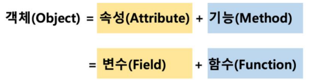
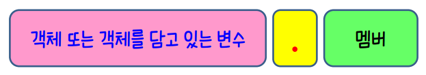
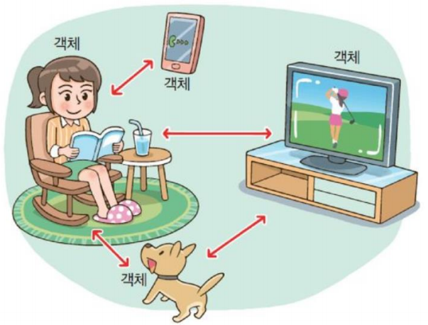
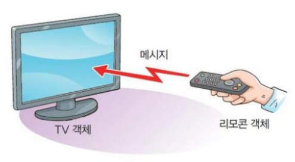
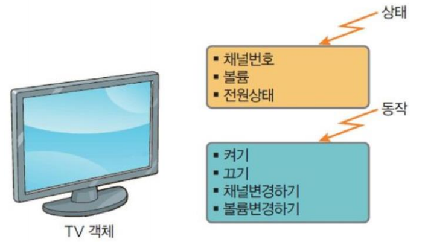
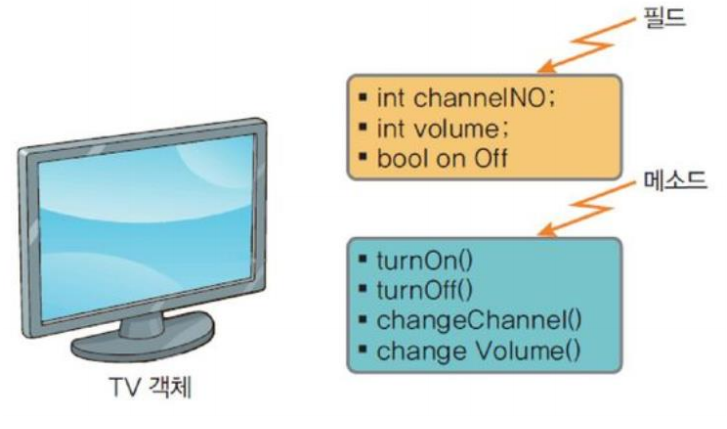
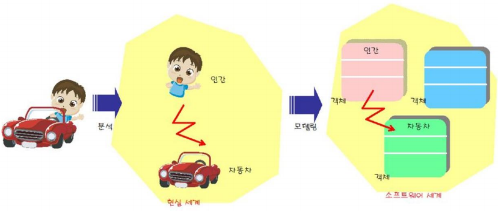
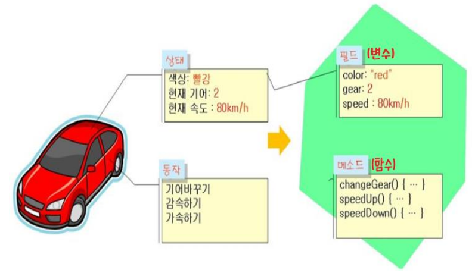
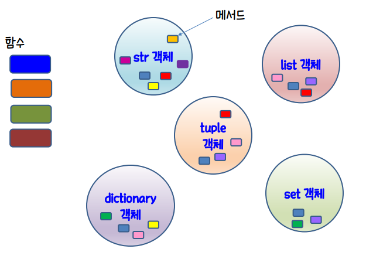

# 객체(object)

> 파이썬은 객체지향 프로그래밍(OOP) 언어

* 객체를 구성하는 변수와 메소드를 객체의 멤버라고 한다.
* 객체의 멤버에 접근할 때는 연산자라고 하는 멤버연산자를 사용한다.



* 문자열, 리스트, 튜플, 딕셔너리, 집합은 모두 *콜렉션 객체*들 이다.
* 연산자를 사용하여 각 객체가 가지고 있는 함수(메소드: 객체에 속한 함수) 호출이 가능하다.

```python
"abc".upper()
[4, 15, 2, 30, 4].count(4)
{1:100, 2:88, 3:90}.get(3)
```

* 다른 객체의 역할이 필요할 때 다음 형식으로 다른 객체의 메소드 또는 변수를 사용한다.




## 객체의 실생활 사용 예














## 객체 정리

