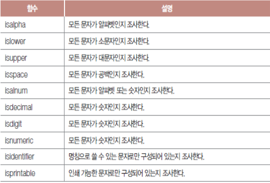
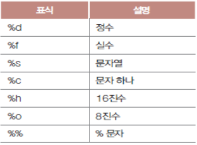
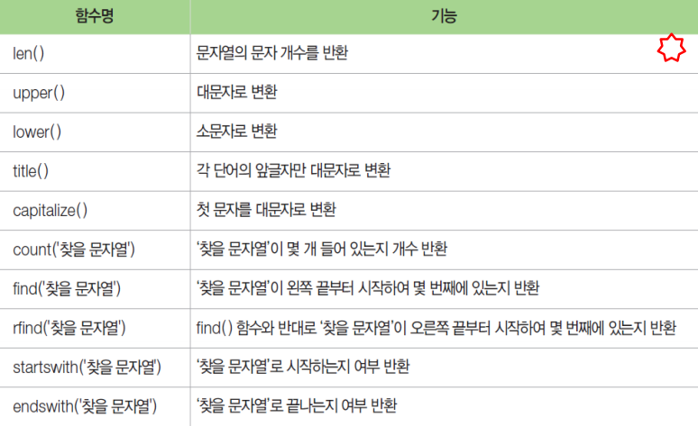
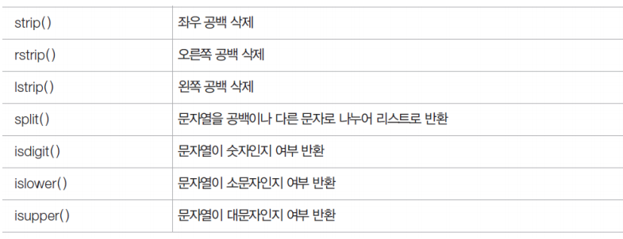

# 문자열 관리

## 1. 문자열 분리

### 첨자

* 문자의 위치

* 대괄호와 첨자를 적어 문자열을 구성하는 개별 문자를 읽는다.

* 앞뒤 양쪽에서 읽을 수 있다.

  ```python
  s = "python"
  print(s[2])   # t
  print(s[-2])  # o
  ```

* for문으로 순회하여 개별 문자를 순서대로 꺼낸다.

  ```python
  s = "python"
  for c in s :
      print(c, end=',') # p,y,t,h,o,n
  ```

### 슬라이스

> 범위를 지정하여 부분 문자열을 추출
>
> [`begin`:`end`:`step`]
>
> ​		시작, 끝, 중간값을 지정

```python
s = "python"
print(s[2:5])  # tho
print(s[3:])   # hon
print(s[2:-2]) # th
```

* 일정 형식을 가진 문자열에서 원하는 정보만 추출할 수 있다.

  ```python
  file = "20171225-104830.jpg"
  print("촬영 날짜 : " + file[4:6] + "월" + file[6:8] + "일")
  # 촬영 날짜 : 12월 24일
  ```


## 2. 문자열 메서드

### 메서드

* 클래스에 소속된 함수
* 객체에 대해 특화된 작업 수행

### 검색

* `len` 함수
  * 문자열의 길이를 조사
* `find` 메서드
  * 인수로 지정한 문자 또는 부분 문자열의 위치 조사
* `rfind` 메서드
  * 뒤에서 검색 시작
* `count` 메서드
  * 특정 문자 개수

```python
s = "python programming"
print(len(s))       # 18
print(s.find('o'))  # 4
print(s.rfind('o')) # 9
print(S.index('r')) # 8
print(s.count('n')) # 2
```

### 조사

* `in` 구문

  * 특정 문자 유뮤 여부 조사

  ```python
  s = "python programming"
  print('a' in s)     # True
  print('x' not in s) # False
  ```

  

### 변경

* `lower` 메서드 / `upper` 메서드 (영문자를 전부 소문자 / 대문자로 바꿈)

```python
s = "Good morning. my love KIM."
print(s.lower())     # good morning. my love kim.
print(s.upper())     # GOOD MORNING. MY LOVE KIM.
print(s)             # Good morning. my love KIM.

print(s.swapcase())  # gOOD MORNING. My LOVE kim.
print(s.capitalize())# Good morning. my love kim.
print(s.title())     # Good Morning. My Love Kim.
```

* 문자열 자체를 변경하는 것은 아니다.
* `lstrip` / `rstrip` / `strip` 메서드 (왼쪽 / 오른쪽 / 양측 공백을 제거함)

```python
s = "  angel  "
print(s + "님")
print(s.lstrip() + "님")
print(s.rstrip() + "님")
print(s.strip() + "님")
```

### 분할

* `split` 메서드 (구분자를 기준으로 문자열을 분할)

```python
s = "짜장 짬뽕 탕슉"
print(s.split()) # ['짜장', '짬뽕', '탕슉']

s2 = "서울->대전->대구->부산"
city = s2.split("->")
print(city)  # ['서울', '대전', '대구', '부산']
for c in city :
    print(c, "찍고", end = ' ') # 서울 찍고 대전 찍고 대구 찍고 부산 찍고
```

* `splitlines` 메서드 (개행 문자나 파일 구분자 등 기준으로 문자열을 잘라 리스트로 만듦)

* `join` 메서드 (문자열의 각 문자 사이에 다른 문자열을 끼워넣음)

  ```python
  s = "._."
  print(s.join("대한민국")) # 대._.한._.민._.국
  ```

### 대체

* `replace` 메서드 (특정 문자열을 찾아 다른 문자열로 대체)

  * 첫 번째 인수 : 검색할 문자열 지정
  * 두 번째 인수 : 바꿀 문자열 지정

  ```python
  s = "독도는 일본땅이다. 대마도도 일본땅이다."
  print(s.replace("일본", "한국")) # 독도는 한국땅이다. 대마도도 한국땅이다.
  ```

* `just` 메서드 (문자열을 특정 폭에 맞추어 정렬)

* `center` 메서드 (중앙 정렬)


## 3. 포맷팅

### 포맷팅

> 문자열 사이사이에 다른 정보를 삽입하여 조립하는 기법



```python
month = 8
day = 15
anni = "광복절"
print("%d월 %d일은 %s이다." % (month, day, anni)) # 8월 15일은 광복절이다.
```

* 서식 
  * %[-]폭[.유효자리수]서식
    * 폭에 `-` 를 지정하여 왼쪽 정렬
    * `.` 기호로 소수점 이하 표시 자리수 설정


## 문자열 관련 주요 함수와 메서드





