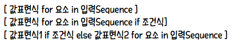
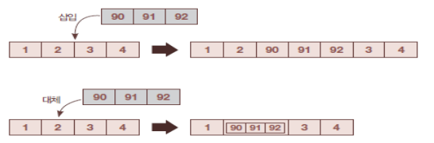

# 리스트(list)

## 1. 리스트

### 자료의 집합

* 리스트는 여러 개 값을 집합적으로 저장한다.

* 요소(element)

  * 리스트에 소속되는 각각의 값
  * 리스트에 주로 같은 타입 요소를 모음

  ```python
  score = [88, 95, 70, 100, 99]
  name = ['최상미', '이한승', '김기남']
  ```

### 리스트의 요소

* 개별요소 읽기 : 대괄호 안에 읽고자 하는 요소의 순서값을 적음
* 요소 분리 : 범위 지정
* 대괄호 첨자를 지정할 수 있음

```python
score = [88, 95, 70, 100, 99]
print(score[2]) # 70
score[2] = 55   # 값 변경
print(score[2]) # 55
```

### 이중 리스트

* 리스트의 요소로 리스트를 넣어 중첩할 수 있다.
* 이중 리스트를 순회하여 최종 값을 읽으려면 루프도 이중으로 해야 한다.

### *** 리스트 컴프리헨션(List Comprehension) - 지능형 리스트

> [값에 대한 수식 `for` 변수 `in` 대상 `if` 조건]

```python
# 리스트 컴프리헨션 방식
nums = [n * 2 for n in range(1, 11)]
for i in nums :
    print(i, end = ', ')
# 2, 4, 6, 8, 10, 12, 14, 16, 18, 20, 
```

```python
# 기존 방식
nums = []
for n in range(1, 11) :
    nums.append(n * 2)
```




## 2. 리스트 관리

### 삽입

* `append` : 인수로 전달한 요소를 리스트 끝에 추가
* `insert` : 삽입할 위치와 요소값을 전달받아 리스트 중간에 삽입

```python
nums = [1, 2, 3, 4]
nums.append(5)
nums.insert(2, 99)
print(nums) # [1, 2, 99, 3, 4, 5]
```

* 범위에 리스트를 대입하여 여러 요소를 한꺼번에 삽입 가능

```python
nums = [1, 2, 3, 4]
nums[2:2] = [90, 91, 92]
print(nums) # [1, 2, 90, 91, 92, 3, 4]

nums = [1, 2, 3, 4]
nums[1] = [90, 91, 92]
print(nums) # [1, [90, 91, 92], 3, 4]
```



### 삭제

* 대상 선택 방법에 다라 다른 메서드 사용
  * `remove` : 인수로 전달받은 요소값 찾아 삭제
  * `del` : 순서값 지정하여 삭제
  * `clear` : 리스트 모든 요소 삭제
  * 빈 리스트 대입 : 일정 범위 요소 다수 삭제

### 검색

* `index` : 특정 요소 위치 찾음
* `count` : 특정 요소값의 개수 조사
* `min` / `max` : 리스트 요소 중 최소값 / 최대값 찾음
* `in` / `not in` : 특정 요소 유무 여부 검사

### 정렬

> 요소를 크기 순으로 재배열

* `sort` : 리스트 정렬하여 요소 순서 조정, 리스트 자체 수정
* `reverse` : 요소 순서 반대로
* `key` : 정렬시 요소 비교할 키 추출
* `sorted` : 리스트 그대로 두고 정렬된 새로운 리스트 만들어 리턴

