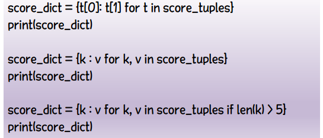
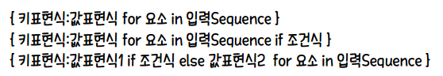

# 사전(dictionary)

### 사전

* 키와 값의 쌍을 저장하는 대용량 자료구조
* 맵 / 연관배열
* 중괄호 안에 키:값 형태로 콤마로 구분하여 나열

```python
dic = { 'boy':'소년', 'school':'학교', 'book':'책' }
```

* 빠른 검색 가능

  * 찾는 키가 없을 경우 예외 발생

    * 체크해서 찾기
    * 예외 처리 구문
    * get 메서드

    ```python
    dic = { 'boy':'소년', 'school':'학교', 'book':'책' }
    print(dic.get('student')) # None
    print(dic.get('student', '사전에 없는 단어입니다.')) # 사전에 없는 단어입니다.
    ```

  * 특정 키 검색 시에는 `in` 구문 사용


### 사전관리

* 실행 중 삽입, 삭제 수정 등 편집 가능

```python
dic = { 'boy':'소년', 'school':'학교', 'book':'책' }
dic['boy'] = '남자'  # 수정
dic['girl'] = '소녀' # 삽입
del dic['book']     # 삭제
print(dic) # { 'boy':'남자', 'girl':'소녀', 'school':'학교' }
```

* `사전[키]`
  * 키의 존재 여부에 따라 동작 다름
    * 존재할 경우 : 기존 값의 변경
    * 존재하지 않을 경우 : 키를 추가
* `del`
  * 해당키를 찾아 값과 함께 삭제
* `keys` / `values` 메서드
  * 사전의 키 / 값 목록 얻음
* `dict_*객체`
  * 리스트처럼 순회하여 값 순서대로 읽음
* `update` 메서드
  * 두 개 사전을 병합
* `dict` 함수
  * 빈 사전 만들거나 다른 자료형을 사전으로 변환


### 사전의 활용

> 노래 가사의 특정 알파벳 출현 횟수


### 사전 컴프리헨션(Dictionary Comprehension) - 지능형 사전

> {키와 값에 대한 수식 `for` 변수 `in` 대상 `if` 조건}





