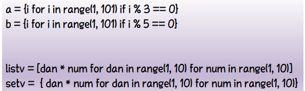
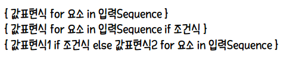
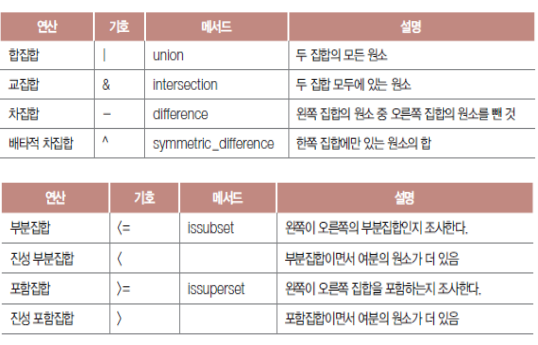

# 집합(set)

### 집합 정의

* 여러 가지 값의 모임
* `set()` 함수
  * 빈 집합 만들거나 다른 컬렉션을 집합형으로 변환

### 집합 컴프리헨션(Set Comprehention) - 지능형 집합

> 값에 대한 수식 `for` 변수 `in` 대상 `if` 조건

* 인수 없이 set() 함수 호출 - 공집합 만들기
* `add` 메서드
  * 집합에 원소 추가
* `update` 메서드
  * 집합끼리 결합하여 합집합 만들기
  * 중복 허용되지 않음에 유의

### 집합 연산

* 연산을 통한 집합 간 조합

