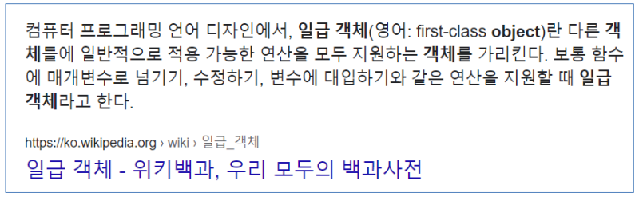
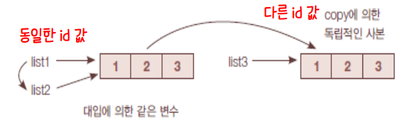
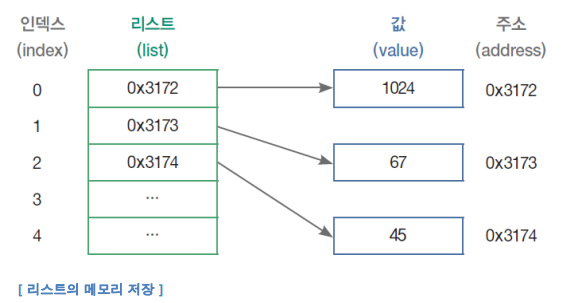
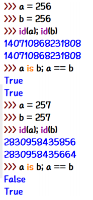
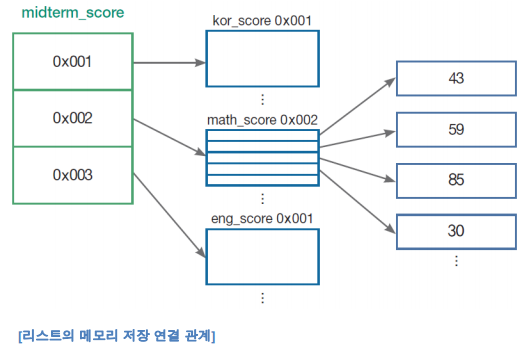
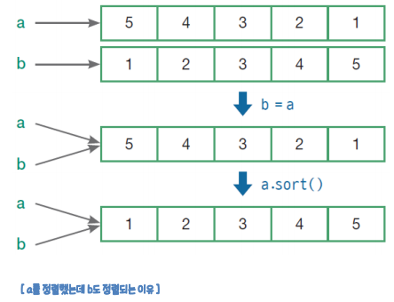
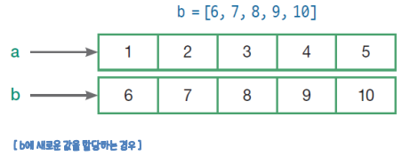

# 컬렉션 관리

## 1. 컬렉션 관리 함수

### 1-1. enumerate

> 순서값과 요소값을 한꺼번에 구하는 내장함수

* 예) 여러 학생의 성적을 출력할 경우
  * for문 이용
    * 순서값을 알 수 없음
    * 별도 변수 활용한 복잡한 과정 통해 순서값 구함
    
    ```python
    score = [88, 95, 70, 100, 99]
    for no in range(len(score)) :
        print(str(no+1) + "번 학생의 성적 :", score[no])
    ```

```python
for i, v in enumerate(['tic', 'tac', 'toe']) :
    print(i, v)
    
# 0 tic
# 1 tac
# 2 toe
```


### 1-2. zip

* 여러 개 컬렉션을 합쳐 하나로 만듦
* 두 리스트의 대응되는 요소끼리 짝지어 `튜플 zip 객체` 생성 -> *1회성*
* 합쳐지는 두 리스트의 길이는 무관
* 생성되는 튜플의 순서는 원본 리스트의 순서와 같음

```python
yoil = ['월', '화', '수', '목', '금', '토', '일']
food = ['갈비탕', '순대국', '칼국수', '삼겹살']
menu = zip(yoil, food)
for y, f in menu :
    print('%요일 메뉴 : %s' % (y, f))
    
# 월요일 메뉴 : 갈비탕
# 화요일 메뉴 : 순대국
# 수요일 메뉴 : 칼국수
# 목요일 메뉴 : 삼겹살
```


#### 파이썬 함수는 일급객체



**파이썬 함수는**

* 변수에 저장할 수 있으며 함수를 담고 있는 변수를 통해서 함수를 호출할 수 있다.
* 다른 함수 호출 시 아규먼트로 전달 가능하다.
* 함수의 리턴 값으로 전달 가능하다.
* 일반적인 데이터 처럼 사용 가능하다.


## 2. 람다 함수

### 2-1. filter 함수

> 리스트 요소 중 조건에 맞는 것만을 골라냄

* 첫 번째 인수 : **조건 지정하는 함수**
* 두 번째 인수 : 대상 리스트

```python
# flunk() : 점수 s를 인수로 받아 60 미만인지 조사
def flunk(s) :
    return s < 60
score = [45, 89, 72, 53, 94]
for s in filter(flunk, score) :
    print(s)
    
# 45
# 53
```


### 2-2. map 함수

> 모든 요소에 대한 변환 함수 호출, 새 요소 값으로 구성된 리스트 생성

* 첫 번째 인수 : **값을 변환하는 함수**
* 두 번째 인수 : 대상 리스트

```python
# half() : 인수로 전달받은 s를 절반으로 나누어 리턴
def half(s) : 
    return s / 2
score = [45, 89, 72, 53, 94]
for s in map(half, score) :
    print(s, end = ', ')
# 22.5, 44.5, 36.0, 26.5, 47.0, 
```


### 2-3. 람다함수

> 이름 없고 입력과 출력만으로 함수를 정의하는 축약된 방법

* lambda 인수 : 식
  * 인수는 여러개 가질 수 있음
  * 인수 : 호출 시 전달받을 아규먼트(생략 가능)
  * 식 : 호출 시 전달할 리턴 값

```python
score = [45, 89, 72, 53, 94]
for s in filter(lambda x:x < 60, score) :
	print(s)
```

* 람다 함수내에서는 변수 정의 불가
* 람다 함수 내에서는 식만 정의 가능

```python
a = lambda : 100
b = lambda x:x*1000
c = lambda v1, v2 : v1 + v2
d = lambda v1, v2 : v1 > v2
e = lambda v1, v2, v3 : sum([v1, v2, v3])
a()           # 100
b(3)          # 3000
c(10, 20)     # 30
d(5, 3)       # True
e(10, 20, 30) # 60
```


## 3. 컬렉션의 사본

### 3-1. 리스트의 사본

* 기본형 변수는 대입 이후 둘 중 하나 바뀌어도 다른 쪽에 영향 없음

```python
a = 3
b = a
print("a = %d, b = %d" % (a, b))
# a = 3, b = 3
a = 5
print("a = %d, b = %d" % (a, b))
# a = 5, b = 3
```

* 컬렉션의 경우, 같은 리스트를 두 변수가 가리키는 것이라 영향 있음

```python
list1 = [ 1, 2, 3 ]
list2 = list1
list2[1] = 100
print(list1) # [1, 100, 3]
print(list2) # [1, 100, 3]
```

* `copy` 메서드로 두 리스트를 완전히 독립 사본으로 만들 수 있음

```python
list1 = [1, 2, 3]
list2 = list1.copy()

list2[1] = 100
print(list1) # [1, 2, 3]
print(list2) # [1, 100, 3]
```

* `list[:]` 으로 전체 범위에 대한 사본을 만드는 방법도 가능 -> *경고오류발생*

```python
list0 = ['a', 'b']
list1 = [list0, 1, 2]
list2 = list1.copy()

list2[0][1] = 'c'
print(list1) # [['a', 'c'], 1, 2]
print(list2) # [['a', 'c'], 1, 2]
```

```python
import copy

list0 = ['a', 'b']
list1 = [list0, 1, 2]
list2 = copy.deepcopy(list1)

list2[0][1] = 'c'
print(list1) # [['a', 'b'], 1, 2]
print(list2) # [['a', 'c'], 1, 2]
```


### 3-2. is 연산자

* `is` 구문을 통해 두 변수가 같은 객체를 가리키는지 조사

```python
list1 = [1, 2, 3]
list2 = list1
list3 = list1.copy()

print('1 == 2', list1 is list2) # 1 == 2 True
print('1 == 3', list1 is list3) # 1 == 3 False
print('2 == 3', list2 is list3) # 2 == 3 Flase
```




## 리스트의 메모리 관리 방식

### 리스트의 메모리 저장

* 파이썬은 리스트를 저장할 대 값 자체가 아니라, 값이 위치한 메모리 주소(reference)를 저장한다.



* `==` 은 값을 비교하는 연산이고, `is` 는 메모리의 주소를 비교하는 연산이다.

  * 아래 코드에서 a와 b의 값은 같지만, 메모리의 저장 주소는 다른 것이다.

    ```python
    a = 300
    b = 300
    a is b # False
    a == b # True
    ```

  * 위의 코드와 다르게 is와 ==연산자는 모두 True를 반환한다.

  * 그렇다면 a와 b의 메모리 주소는 같은 것일까?

  * 이것은 파이썬의 *정수형 저장 방식의 특성* 때문이다.

  * 파이썬은 인터프리터가 구동될 때, **-5부터 256까지의 정수값을 특정 메모리 주소에 저장**한다.

  * 그리고 해당 숫자를 할당하려고 하면 해당 변수는 그 숫자가 가진 메모리 주소로 연결한다.

    ```python
    a = 1
    b = 1
    a is b # True
    a == b # True
    ```

    

* 리스트는 기본적으로 값을 연속으로 저장하는 것이 아니라, 값이 있는 주소를 저장하는 방식이다.




### 메모리 저장 구조로 인한 리스트의 특징

* 다양한 형태의 변수가 하나의 리스트에 들어갈 수 있다.

```python
a = ['color', 1, 0.2]
```

> 기존 변수들과 함께 리스트 안에 다른 리스트를 넣을 수 있다. 흔히 이를 중첩 리스트라고 한다.
>
> 이러한 특징은 파이썬의 리스트가 값이 아닌 메모리의 주소를 저장해 메모리에 새로운 값을 할당하는 데 있어 매우 높은 자유도를 보장하므로 가능하다.

* 리스트의 저장 방식

  * b와 a 변수를 각각 다른 값으로 선언한 후, b에 a를 할당하였다. 그리고 b를 출력하면, a 변수와 같은 값이 화면에 출력된다.

  ```python
  a = [5, 4, 3, 2, 1]
  b = [1, 2, 3, 4, 5]
  b = a
  print(b) # [5, 4, 3, 2, 1]
  ```

  * a만 정렬하고 b를 출력했을 때 b도 정렬되었다. 두 변수가 같은 메모리 주소와 연결되어 있으므로, 하나의 변수 값만 바뀌더라도 둘 다 영향을 받는다.

  ```python
  a.sort()
  print(b) # [1, 2, 3, 4, 5]
  ```

  
  * b에 새로운 값을 할당하면 b는 이제 새로운 메모리 주소에 새로운 값을 할당할 수 있는 것이다.

  ```python
  b = [6, 7, 8, 9, 10]
  print(a, b) # [1, 2, 3, 4, 5] [6, 7, 8, 9, 10]
  ```

  


