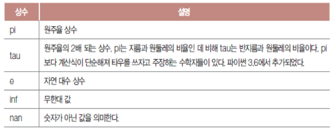
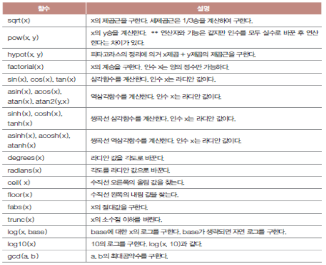
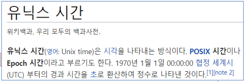
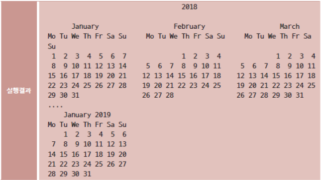
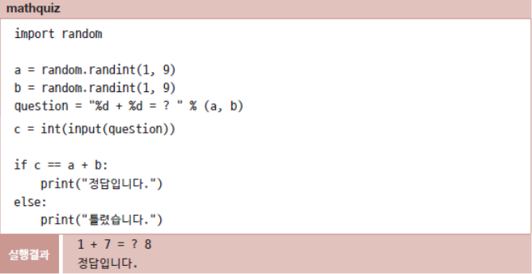
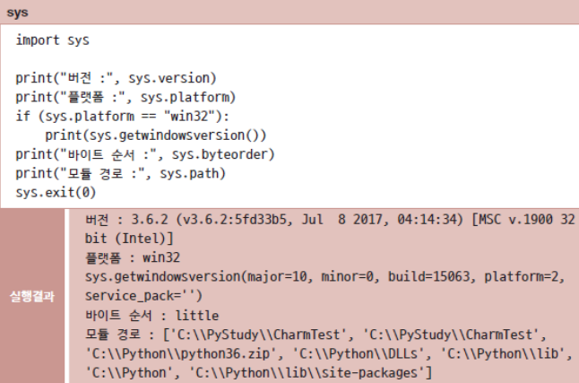
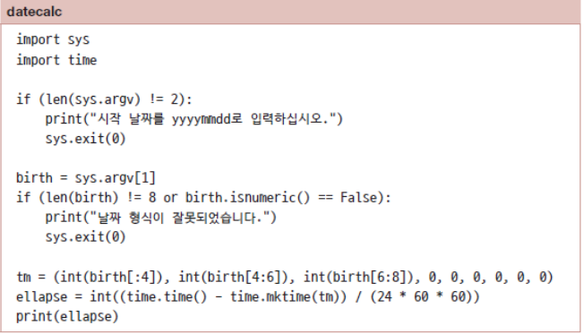

# 표준 모듈

### 0. 모듈의 활용

> import 모듈 [as 별칭]
>
> from 모듈 import 함수명 [ as 별칭 ] [, 함수명 [ as 별칭 ]]

* 모듈

  * 파이썬 코드를 저장하는 기본 단위
  * 파이선 소스 파일로서 `.py` 빼고 파일명으로 불림
  * 파이썬에서 자주 사용하는 기능은 표준 모듈로 제공됨
  * 내가 만든 파이썬 파일도 모듈이 될 수 있음
  * 다른 파이썬 소스 즉 모듈의 함수나 변수 등을 현재 파이썬 소스에서 사용하려면 `import` 구문으로 포함시켜야 함

  

## 1. 수학

### 1-1. 임포트

* `from 모듈 import 함수명`

  * 모듈의 함수 호출

  ```python
  from math import sqrt
  print(squr(2))
  ```


### 1-2. math 모듈

* 정밀한 계산을 위한 복잡한 수학 연산 함수






## 2. 시간

### 2-1. time 모듈

* 날짜와 시간 관련 기능 제공
* 에폭(Epoch) / 유닉스 시간

```python
import time
print(time.time())
```

* 일상 시간 문자열로 변환 가능

```python
import time
t = time.time()
print(time.ctime(t))
```



* 보다 편리한 형태로 조립하려면

  * `localtime` 함수

    * 지역 시간 고려하여 현지 시간 구함
    * 시간 요소 멤보로 가지는 strut_time형 객체 반환
    * 정보 분리하여 문자열로 조립

    ```python
    time.struct_time(tm_year=2021, tm_mon=7, tm_mday=15,
                tm_hour=13, tm_min=30, tm_sec=47, tm_wday=2, tm_yday=204,
                tm_isdst=0)
    ```


### 2-2. 실행 시간 측정

* time 함수 호출하는 시점에 따라 구해지는 시간이 다름을 이용
* 두 지점 간의 경과 시간 측정
  * 소수점 이하 값까지 지정 가능

```python
import time

start = time.time()
for a in range(1000) :
    print(a)
end = time.time()
print(end - start)
```


### 2-3. calendar 모듈

* 달력 기능
* 인수로 받은 연도의 달력 객체 반환
* `month` 함수
  * 연도와 달을 인수로 받아 해당 월 달력 객체 반환
* `weekday` 함수
  * 특정 날짜가 어떤 요일인지 조사

```python
import calendar

print(calendar.calendar(2018)) # calendar.prcal(2018)
print(calendar.month(2019, 1)) # calendar.prmonth(2019, 1)
```




## 3. 난수

### 3-1. random 모듈

* 난수 생성 기능

* 어떤 수가 나올 지 예측할 수 없는 무작위 동작 구현

* `randint(begin, end)'`

  * 일정 범위의 정수 난수 범위 설정

  ```python
  import random
  for i in range(5) :
      print(random.randint(1, 10))
  ```

* `randrange(begin, end)`

  * end는 범위에서 제외

* `choice` 함수

  * 리스트에서 임의의 요소 하나 골라 반환

* `shuffle` 함수

  * 리스트의 요소 무작위로 섞음

  ```python
  import random
  food = ['짜장면', '짬뽕', '탕수육', '군만두']
  print(food) # ['짜장면', '짬뽕', '탕수육', '군만두']
  random.shuffle(food)
  print(food) # ['군만두', '짬뽕', '짜장면', '탕수육']
  ```

* `sample` 함수

  * 리스트 항목 중 n개를 무작위로 뽑아 새 리스트 만듦


### 3-2. 산수 문제 내기

* 난수로 무작위 숫자 두 개를 골라 산수 문제 출제하는 프로그램




## 4. sys 모듈

### 4-1. sys 모듈

* 파이썬 해석기가 실행되는 환경과 해석기의 여러 기능 조회 및 관리




### 4-2. 명령행 인수

* 파이썬에서 실행 파일 뒤에 인수를 전달할 수 있음
  * a.txt / b.txt
    * 명령행 인수
    * 명령 수행할 대상이나 옵션 지정
  * `sys.argv` 읽어 명령행 인수의 값 읽을 수 있음

```python
copy a.txt b.txt

import sys
print(sys.argv)
```


### 4-3. 경과일 계산

* 특정 날짜로부터 오늘까지 며칠이 경과되었는지 계산하여 출력



* 명령행으로 인수를 전달할 경우 사용자가 사용법을 확실히 숙지해야 함
  * 인수 보다는 질문을 하고 직접 입력받아 사용하는 것이 보다 정확함

