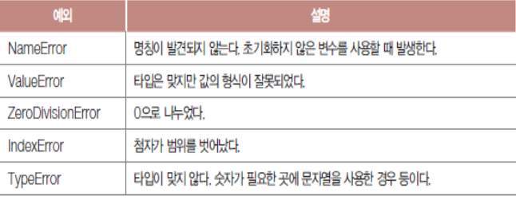
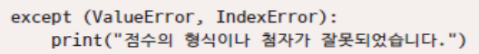

# 예외 처리

## 1. 예외 처리

### 1.1 예외(exception)

> 프로그램 코드는 이상이 없으나 실행 중에 불가피하게 발생하는 문제

```python
str = "89점"
score = int(str)
print(score)
print("작업완료")
```

> Traceback (most recent call last):
>   File "C:/yyj/pythonexam/day10/exceptionTest1.py", line 2, in <module>
>     score = int(str)
> ValueError: invalid literal for int() with base 10: '89점'

* 에러 발생 직후 프로그램이 종료되어 이후 명령을 무시한다.


### 1.2 예외 처리


* 간단하게 `try:` `except:` 까지만 사용하는 것도 가능하다.
  * 예외가 발생하지 않으면 except 블록을 무시하고 다음 문장 실행

```python
str = "89점"
try:
    score = int(str)
    print(score)
except:
    print("예외가 발생했습니다.")
    '''import sys
    sys.exit(-1)'''
print("작업완료")

# 예외가 발생했습니다.
# 작업완료
```

* 상황 자체를 해결하지는 않으나 예외 인식 / 처리 기회 제공한다.
* 예외 처리 구문을 루프로 감싸면 무엇이 잘못되었는지 알려준다.
  * 전체를 무한 루프로 감싸 예외 발생 시 다시 루프 선두로 돌아감


### 1.3 예외의 종류



```python
str = "89"
try:
    score = int(str)
    print(score)
    a = str[5]
except ValueError:
    print("점수의 형식이 잘못되었습니다.")
except IndexError:
    print("첨자 범위를 벗어났습니다.")
print("작업완료")
```

>  89
> 첨자 범위를 벗어났습니다.
> 작업완료

* str[5] -> IndexError 예외 발생한다.
* except 블록이 아무리 많아도 먼저 발생한 예외에 맞는 하나만 선택된다.


* 두 개 이상 괄호로 묶어 except 블록에서 동시에 받기 가능하다.




### 1.4 raise 명령

> 고의적으로 예외를 발생시킨다.

* 작업을 위한 선결조건이 맞지 않거나 문제가 발생할 경우 호출원으로 사용한다.

```python
def calcsum(n):
    if (n < 0):
        raise ValueError
    sum = 0
    for i in range(n+1):
        sum = sum + i
    return sum

try:
    print("~10 =", calcsum(10))
    print("~-5 =", calcsum(-5))
except ValueError:
    print("입력값이 잘못되었습니다.")
```

> ~10 = 55
> 입력값이 잘못되었습니다.


* 특이값을 리턴하는 방식도 가능하다.
  * 리턴값 점검에 철저할 것

```python
def calcsum(n):
    if (n < 0):
        return -1
    sum = 0
    for i in range(n+1):
        sum = sum + i
    return sum

result = calcsum(10)
if result == -1:
    print("입력값이 잘못되었습니다.")
else:
    print("~10 =", result)

result = calcsum(-5)
if result == -1:
    print("입력값이 잘못되었습니다.")
else:
    print("~10 =", result)
```

> ~10 = 55
> 입력값이 잘못되었습니다.


## 2. 자원 정리

### 2.1 finally 블록

* 예외 발생 여부와 무관하게 반드시 실행해야 할 명령을 지정한다.

```python
try:
    print("네트워크 접속")
    a = 2 / 0
    print("네트워크 통신 수행")
except ZeroDivisionError as z :
    print(z)
    '''import sys
    sys.exit(-1)'''
finally:
    print("접속 해제")
print("작업 완료")
```

> 네트워크 접속
> division by zero
> 접속 해제
> 작업 완료


### 2.2 assert 문장

> assert 조건, 메시지

```python
score = 128
assert score <= 100, "점수는 100 이하여야 합니다."
print(score)
```


