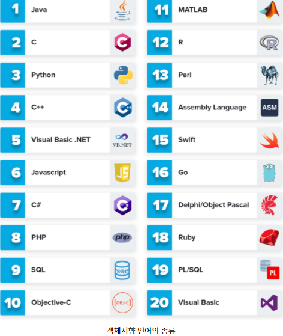
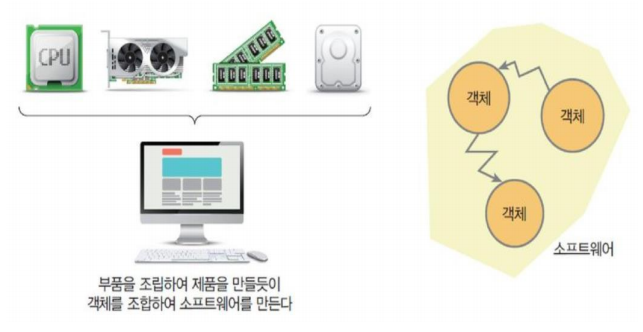
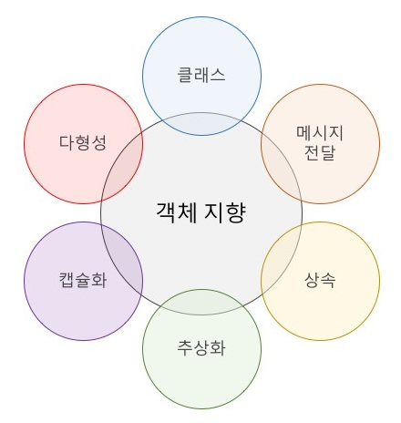

# OOP(Object Oriented Programming)

## 객체 지향 언어의 종류

## 객체 지향 프로그래밍이란?

> 객체 지향 프로그래밍은 프로그램에서 필요한 객체들의 역할을 정해 놓고 이 객체 안에 관련된 변수와 함수를 정의하여 객체 단위로 기능이 처리되도록 하는 프로그래밍 기법으로, 재사용성이 좋은 컴퓨터 공학의 프로그래밍 기법 중 하나이다.

## 파이썬 객체 지향 구문의 특성

* 스크립트 언어는 가볍게 구현하는 것이 목적
* 파이썬은 스크립트 언어임에도 불구하고 C++과 모듈러 3의 문법을 계승하여 OOP 구문 지원
* 클래스 정의, 다중 상속, 연산자 오버로딩 지원
* 파이썬은 객체 지향을 지원할 뿐 완성도는 떨어짐
* 객체지향의 가장 기본적인 개념 : 클래스
  * 클래스 - 속성과 동작을 하나의 범주로 묶어서 실세계의 사물을 프로그램 코드로 흉내 냄
* 모델링 - 사물을 분석하여 필요한 속성과 동작을 추출하는 것
* 캡슐화 - 모델링한 결과를 클래스로 포장

## 객체 지향 프로그래밍의 장점

1. 재사용성

   > 상속을 통해 프로그래밍 시 코드의 재사용을 높일 수 있다.

2. 생산성 향상

   > 잘 설계된 클래스를 만들어서 독립적인 객체를 사용함으로써 개발의 생산성을 향상시킬 수 있다.

3. 자연적인 모델링

   > 일상생활 모습의 구조가 그대로 자연스럽게 구현될 수 있다.

4. 유지보수의 우수성

   > 프로그램 추가, 수정 시 캡슐화를 통해 주변 영향을 덜 받으므로 유지보수가 쉽다.

