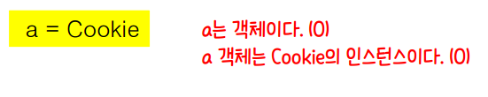
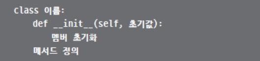
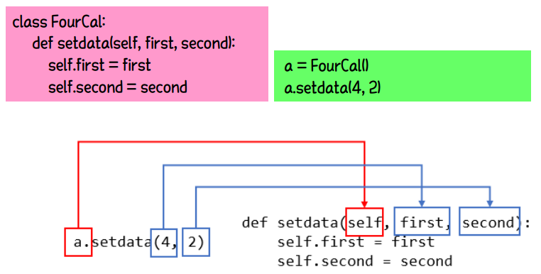
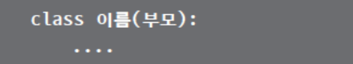
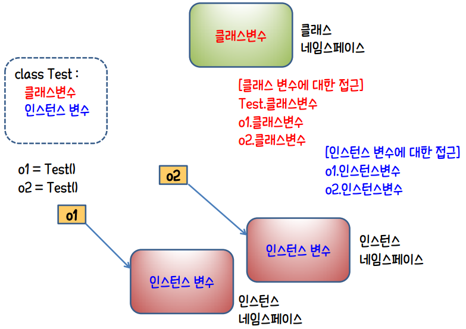
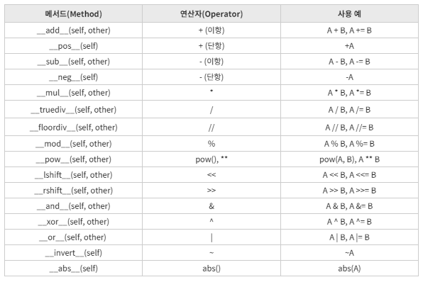
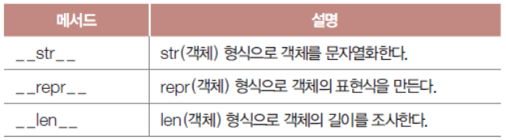

# Class

## 1. 클래스

### 1-1. 클래스의 정의

* 객체지향의 가장 기본적 개념

* 관련된 속성과 동작을 하나의 범주로 묶어 실세계의 사물을 흉내 냄

* 모델링

  * 사물을 분석하여 필요한 속성과 동작을 추출

* 캡슐화

  * 모델링 결과를 클래스로 포장

    ```python
    balance = 8000
    
    def deposit(money):
        global balance
        balance += money
        
    def inquire():
        print("잔액은 %d원입니다." % balance)
        
    deposit(1000)
    inquire()
    # 잔액은 9000원입니다.
    ```


#### 객체의 속성은 '변수'로, 동작은 '함수'로 표현

* 멤버
  * 클래스 구성하는 변수와 함수
* 메서드
  * 클래스에 소속된 함수


#### 객체와 인스턴스

> 인스턴트라는 말은 특정 객체(a)가 어떤 클래스(Cookie)의 객체인지를 **관계** 위주로 설명할 때 사용한다.




### 1-2. 생성자

* 클래스 선언 형식

* `__init__` 생성자

  * 통상 객체 초기화

    ```python
    class Human:
        def __init__(self, age, name):
            self.age = age
            self.name = name
        def intro(self):
            print(str(self.age) + "살 " + self.name + "입니다.")
    
    kim = Human(29, "김상형")
    kim.intro()
    lee = Human(45, "이승우")
    lee.intro()
    ```

    

* 객체 생성 구문

  * 객체를 `__init__`의 첫 번째 인수 self로 전달

  * 생성문에서 전달한 인수를 두 번째 이후의 인수로 전달

  * 새로 생성되는 객체 멤버에 대입

    

* 메서드는 필요한 만큼 선언할 수 있음

  * `객체.메서드()`




### 1-3. 상속

* 기존 클래스를 확장하여 멤버 추가하거나 동작 변경

  * 클래스 이름 다음의 괄호 안에 부모 클래스 이름 지정

    

    ```python
    class Human:
        def __init__(self, age, name):
            self.age = age
            self.name = name
    
        def intro(self):
            print(str(self.age) + "살 " + self.name + "입니다")
        def eat(self):
            print("밥을 먹는다")
    
    
    class Student(Human):
        def __init__(self, age, name, stunum):
            super().__init__(age, name)
            self.stunum = stunum
    
        def intro(self):
            super().intro()
            print("학번 : " + str(self.stunum))
    
        def study(self):
            print("하늘천 따지 검을현 누를황")
    
    
    kim = Human(29, "김상형")
    kim.intro()
    kim.eat()
    print("-*-"*10)
    lee = Student(34, "이승우", 930011)
    lee.intro()
    lee.study()
    lee.eat()
    ```

* `super()` 메서드

  * 자식 클래스에서 부모의 메서드 호출할 때 사용


### 클래스 변수와 인스턴스 변수




## 2. 여러 가지 메서드

### 2-1. 클래스 메서드

* 특정 객체에 대한 작업을 처리하는 것이 아니라 클래스 전체에 공유

  * `@classmethod` 데커레이터를 사용해서 정의

  * 첫 번째 인수로 클래스에 해당하는 cls 인수를 정의한다.

    ```python
    class Car:
        count = 0
        def __init__(self, name):
            self.name = name
            Car.count += 1
        @classmethod
        def outcount(cls):
            print(cls.count)
            
    pride = Car("프라이드")
    korando = Car("코란도")
    Car.outcount()
    # 2
    ```


### 2-2. 정적 메서드

> 클래스에 포함되는 단순한 유틸리티 메서드
>
> - 특정 객체에 소속되지 않고 클래스와 관련된 동작을 하는 것도 아니어서 self나 cls를 인수로 받지 않는다.
>
> - 정의할 때 `@staticmethod` 데커레이터를 붙인다.

```python
class Car:
    @staticmethod
    def hello():
        print("오늘도 안전 운행 합시다.")
    count = 0
    def __init__(self, name):
        self.name = name
        Car.count += 1
    @classmethod
    def outcount(cls):
        print(cls.count)
Car.hello()
# 오늘도 안전 운행 합시다.
```


### 2-3. 연산자 메서드




### 2-4. 특수 메서드

> 특정한 구문에 객체가 사용될 경우 미리 약속된 작업 수행



```python
class Human:
    def __init__(self, age, name):
        self.age = age
        self.name = name
    def __str__(self):
        return "이름 %s, 나이 %d" % (self.name, self.age)
    
kim = Human(29, "김상형")
print(kim)
```


