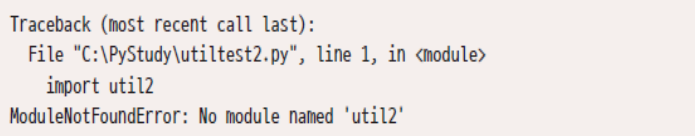
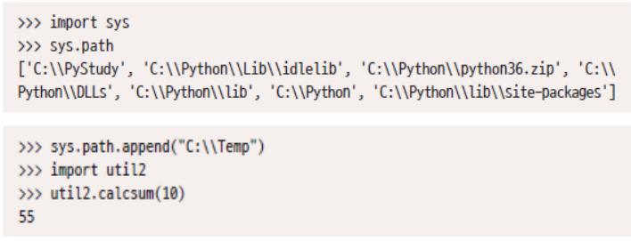
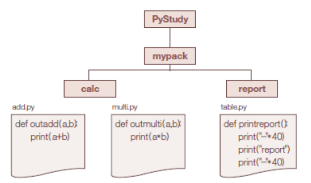
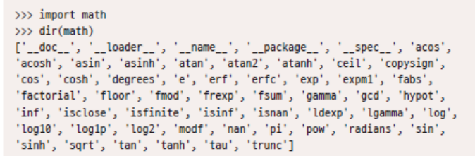
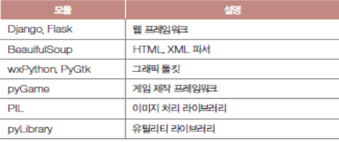
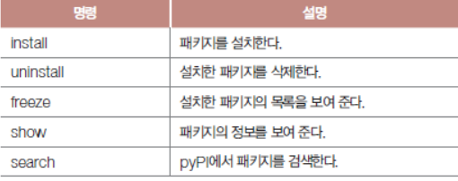

# 모듈

## 1. 모듈

### 1-1. 모듈 작성 및 사용

* 모듈

  * 파이썬 코드를 저장하는 기본 단위

  * 편의상 스크립트를 여러 개의 파일로 나눈 하나

  * `.py` 빼고 파일명으로 불림

  * 파이썬에서 자주 사용하는 기능은 표준 모듈로 제공됨

  * 직접 제작 가능

    ```python
    # util.py
    INCH = 2.54
    
    def calcsum(n):
        sum = 0
        for num in range(n + 1):
            sum += num
        return sum
    ```

    ```python
    # utiltest.py
    import util
    
    print("1inch =", util.INCH)
    print("~10 =", util.calcsum(10))
    ```


### 1-2. 테스트 코드

* 모듈에 간단한 테스트 코드를 작성할 수 있음

```python
INCH = 2.54

def calcsum(n):
    sum = 0
    for num in range(n + 1):
        sum += num
    return sum

print("인치 =", INCH)
print("합계 =", calcsum(10))
```
* 타 모듈에 함수 제공하는 모듈에서는 테스트 코드를 조건문으로 감쌈

```python
# util2.py
INCH = 2.54

def calcsum(n):
    sum = 0
    for num in range(n + 1):
        sum += num
    return sum

if __name__ == "__main__":
    print("인치 =", INCH)
    print("합계 =", calcsum(10))
```

```python
import util2

print("1inch =", util2.INCH)
print("~10 =", util2.calcsum(10))
```


### 1-3. 모듈 경로

* 모듈은 임포트 하는 파일과 같은 디렉토리에 있어야 함



* 모듈을 특정 폴더에 두려면 임포트 패스에 추가




## 2. 패키지

### 2-1. 패키지

* 모듈을 담는 디렉토리
* 디렉토리로 계층을 구성하면 모듈을 기능 등에 따라 분류 가능



```python
import sys
sys.path.append("C:/PyStudy")
print(sys.path)

import mypack.calc.add
mypack.calc.add.outadd(1,2)

import mypack.report.table
mypack.report.table.outreport()


import mypack.calc.add as my1
my1.outadd(1,2)

import mypack.report.table as my2
my2.outreport()

from mypack.calc import add
add.outadd(1,2)

from mypack.calc import add as unico
unico.outadd(1,2)

'''
from mypack.calc import *
add.outadd(1,2)
multi.outmulti(10,20)
'''
```

* 함수명이나 모듈명에 충돌 발생하지 않음

* 단일 모듈에 비해 호출문이 길어지는 불편함이 있음

  > from 패키치 import 모듈


### 2-2. `__init__.py`

* 모든 모듈을 한꺼번에 불러올 때는 어떤 모듈 대상인지 밝혀두어야 함
* 임포트 할 대상 모듈 리스트를 명시
* 패키지가 로드될 때의 초기화 코드를 작성해 둠

```python
import sys
sys.path.append("C:/PyStudy")

from mypack.calc import *
add.outadd(1,2)
multi.outmulti(1,2)

# 가능하지만 권장되지는 않는 방법
from mypack.report.table import *
outreport()
a()
b()
c()
```

```python
__all__ = ["add", "multi"]
print("add module imported")
```

* `import*`로 읽을 때 add 및 multi 모듈을 모두 읽어 옴
* `__init__.py` 의 초기화 코드 실행
* `__init__.py` 목록에 어떤 모듈을 작성할 것인지는 패키지 개발자 재량
* 한 번 임포트한 모듈은 컴파일 상태로 캐시에 저장
  * 확장자 pyc
  * 한 모듈을 각각 다른 파이썬 버전끼리 공유 가능


## 3. 서드 파티 모듈

### 3-1. 모듈의 내부

* 각 모듈은 기능별로 나누어져 다수 함수를 포함

* `dir` 내장 함수를 사용하면 모듈의 멤버들 검토 가능

  *  모듈에 있는 함수나 변수 목록 조사

    


### 3-2. 외부 모듈의 목록

* 서드 파티 모듈(Third Party Module)

  * 파이썬 외 회사 및 단체가 제작하여 배포하는 모듈

    

* pip (package installer for Python)

  * 외부 모듈 관리에 용이

  * pip 명령 패키지명

    

```python
import wx

app = wx.App()
frame = wx.Frame(None, 0, "파이썬 만세")

frame.Show(True)
app.MainLoop()
```

