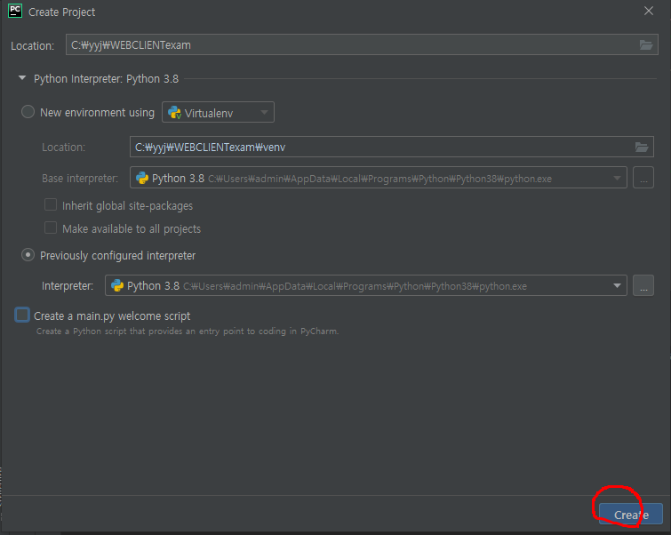
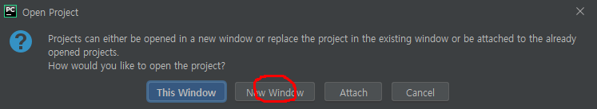
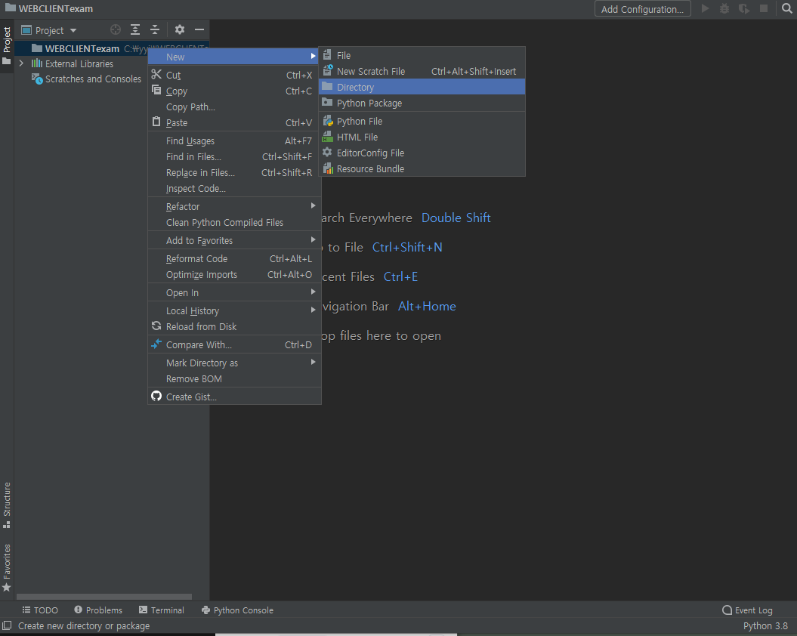
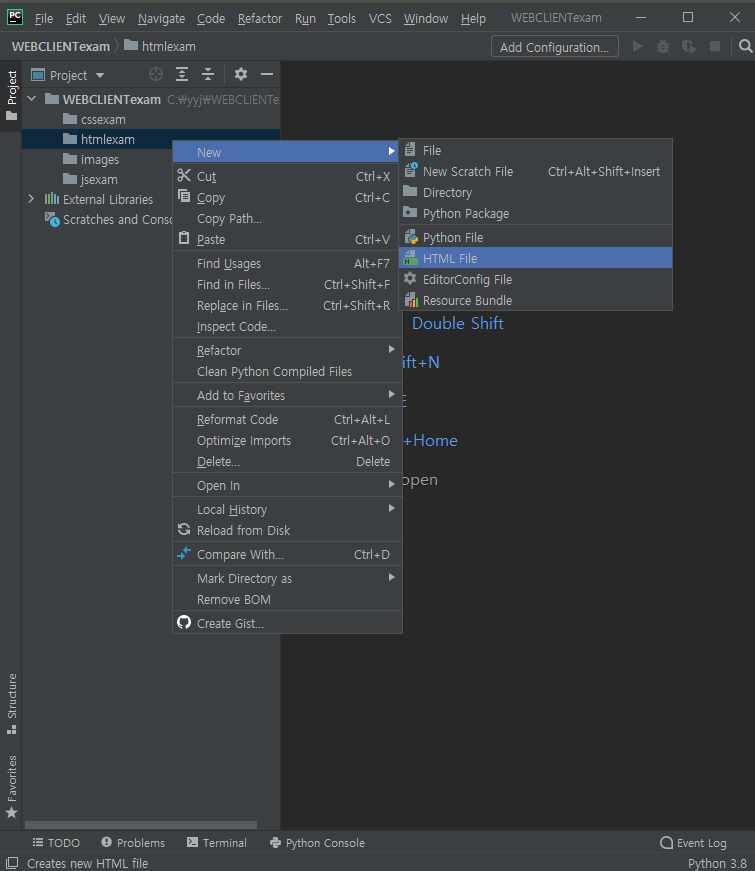

# HTML config

### 1. Create Project

> File >  New Project
>
> * Location을 설정한다.
> * 'Create a main.py welcom script'는 선택을 해제한다.

### 2. Create Directory

> 해당 Project 우클릭 > New > Directory

### 3. Create HTML file

> 해당 Direcroty 우클릭 > New > HTML file

