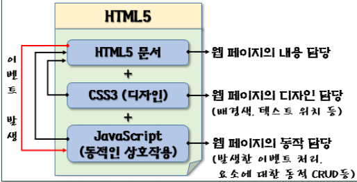
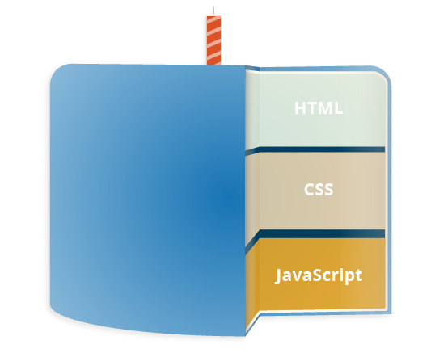
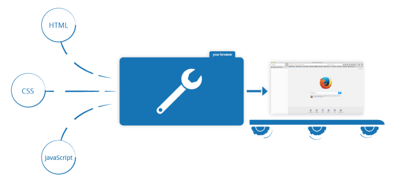

# Web Client 기술

교재 : 생활코딩! HTML + CSS + JavaScript [생활코딩](https://opentutorials.org/course/1)

유용 사이트 : [www.w3schools.com](https://www.w3schools.com/)

## [Web Programming]

> Web Site를 개발하는 기술
>
> 1. Web Client Programming
>
>    : HTML, CSS, JavaScript(jQuery), AJAX, HTML5 API (canvas, multimedia, drag&drop, web storage, geolocation)
>
> 2. Web Server Programming
>
>    : dJango, DataBase 연동(SQLite)

### 웹 표준이란?

* 특정 브라우저에서만 사용하는 비 표준화된 기술을 배제하고, W3C라는 조직에서 정한 표준 기술만을 사용하여, 웹 페이지 작성시 문서의 구조와 표현방법 그리고 상호 동작을 구분하여 구현하는 것을 말한다.

* 웹 문서의 구조를 담당하는 것은 HTML 이고 표현을 담당하는 것은 CSS이며 동작을 담당하는 것은 자바스크립트이다.

* 3가지 요소가 유기적으로 결합하여 작동하게 하면, 웹 문서가 가벼워지며, 유지보수 및 수정 시에도 갂편하고 빨리 처리할 수 있게 된다.

### 웹 표준의 목표

> Web은 어디서든, 누구나 정보를 함께 공유하고 즐길 수 있어야 한다.

### 표준 웹 기술

* [HTML](https://developer.mozilla.org/ko/docs/Glossary/HTML)은 제공할 웹 컨텐츠의 구조와 의미를 문단, 제목, 표, 삽입 이미지, 동영상 등으로 정의하고 부여하는 마크업 언어이다.
* [CSS](https://developer.mozilla.org/ko/docs/Glossary/CSS)는 배경색, 폰트 등의 레이아웃 등을 지정하여 HTML 컨텐츠를 꾸며주는 스타일 규칙 언어이다.
* [JavaScript](https://developer.mozilla.org/ko/docs/Glossary/JavaScript)는 동적으로 컨텐츠를 바꾸고, 멀티미디어를 다루고, 움직이는 이미지 등을 할 수 있는 스크립트 언어이다.

### [해석형 언어와 컴파일러형 언어](https://developer.mozilla.org/ko/docs/Learn/JavaScript/First_steps/What_is_JavaScript#interpreted_versus_compiled_code)

프로그래밍을 하는 입장에서 인터프리트와 컴파일이라는 개념에 대해서는 들어보았을 것입니다. 자바스크립트는 해석형 언어입니다. 따라서 코드가 위에서 아래로 순차적으로 실행되고 그 즉시 결과가 반환됩니다. 브라우저에서 동작하기 전에 다른 방식으로 코드를 변환할 필요가 없습니다.

반면에 컴파일러형 언어는 컴퓨터에 의해 동작되기전 다른 형식으로 변환하는 언어입니다. 예를 들면 C/C++과 같은 언어는 어셈블리어로 컴파일되어 동작됩니다.

이 둘의 관점은 각각의 장점을 가지고 있으니 다음장 부터 한번 알아봅시다.

### [서버측 코드와 클라이언트측 코드](https://developer.mozilla.org/ko/docs/Learn/JavaScript/First_steps/What_is_JavaScript#server-side_versus_client-side_code)

웹 개발 맥락에서 서버측과 클라이언트측 코드에 대해 들어보았을 것입니다. 클라이언트측 코드란 사용자의 컴퓨터에서 작동되는 코드입니다. 만약 웹페이지를 보고자 한다면, 클라이언트측 코드가 사용자의 컴퓨터로 다운로드되고 브라우저가 이를 표시합니다. 이러한 자바스크립트 모듈을 정확히는 클라이언트측 자바스크립트라고 합니다.

반면 서버측 코드는 서버에서 작동되고, 그 결과가 사용자의 브라우저에 넘어가 표시됩니다. PHP, Python, Ruby, ASP.NET등이 서버측 웹 언어의 대표적 예라고 볼 수 있습니다. 물론 자바스크립트도 가능합니다! 유명한 Node.js란 환경을 통해 서버측에서도 자바스크립트가 사용 가능합니다. [Dynamic Websites – Server-side programming](https://developer.mozilla.org/en-US/docs/Learn/Server-side)에서 서버측 자바스크립트에 대해 더 알 수 있습니다.

### [동적 VS 정적 코드](https://developer.mozilla.org/ko/docs/Learn/JavaScript/First_steps/What_is_JavaScript#dynamic_versus_static_code)

"동적"이라는 말은 클라이언트측 서버측 언어 모두를 가르킵니다. 이는 각기 다른 상황에서 적절한 정보가 보이고, 컨텐츠를 웹페이지나 앱 상에 계속적으로 노출시키는 역할을 합니다. 서버측 코드는 데이터베이스로 부터 데이터를 던지는 등 동적으로 새로운 컨텐츠들을 만듭니다. 반면에, 클라이언트측 자바스크립트는 새로운 HTML 표를 만들어 서버에서 요청한 데이터를 뿌려 사용자에게 보이는 등 동적으로 브라우저 안에서 작동됩니다. 이 둘 사이는 서로 미묘한 차이가 있지만, 서로 연관되어 있고 서버측 클라이언트측의 관계와 접근에 대해 알 필요가 있습니다.

동적으로 바뀌지 않는 페이지를 "정적"페이지라고 합니다. (항상 같은 콘텐츠를 보여줍니다.)

