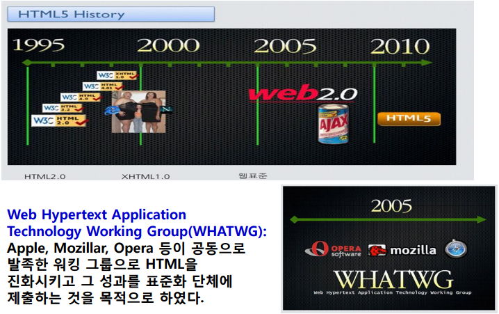
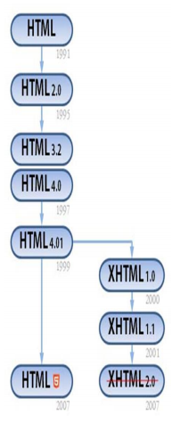
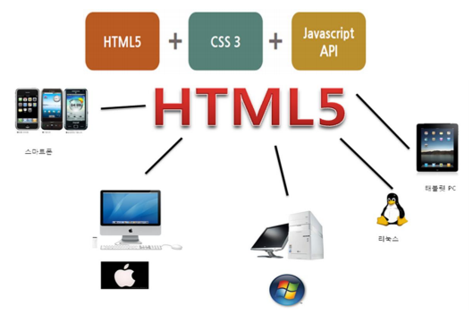
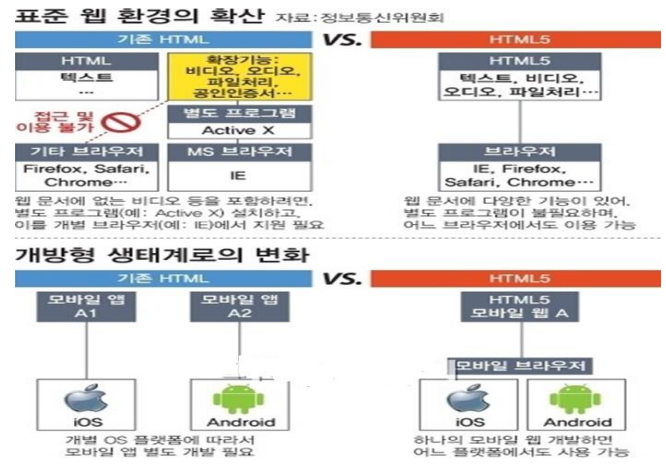
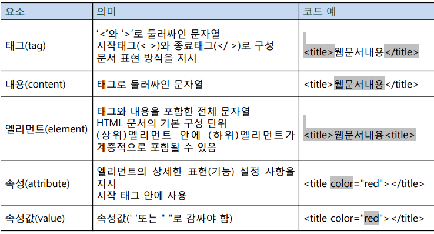
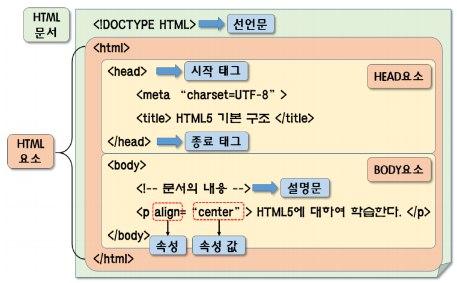
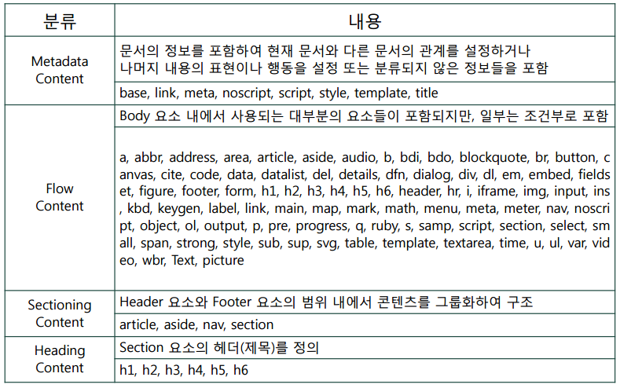
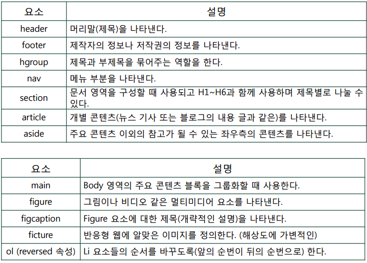
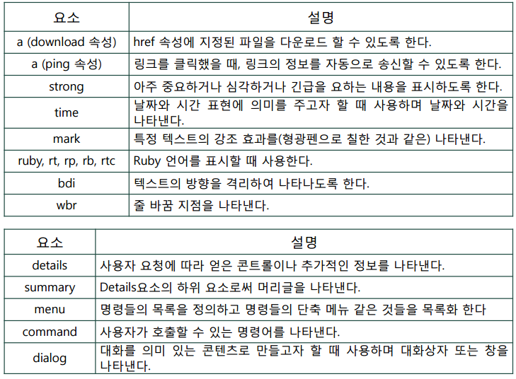
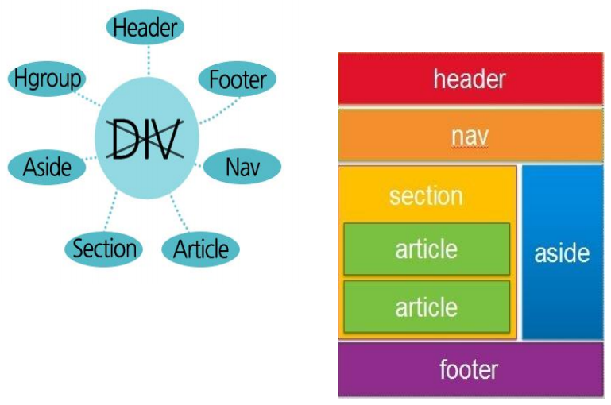

# HTML5

## HTML5의 도입배경

## HTML5의 영향

## HTML5 문서 구성

> HTML5 문서의 작성은 다음과 같은 5가지의 기본 요소들로 구성된다.

## HTML5의 문서구조

## HTML5의 태그 리스트

### HTML5에 추가된 태그들

#### `<video>`, `<audio>` 태그속성

* src
  * 동영상 파일의 경로를 지정
* poster
  * 동영상이 화면에 나타나지 않을 때 대신 표시할 그림을 지정
* preload
  * 동영상이 백그라운드에서 다운로드 되어 재생 단추를 눌렀을 때 재생
* autoplay
  * 동영상 자동 재생
* loop
  * 반복 재생 횟수 지정
* controls
  * 동영상 화면에 컨트롤 기능 추가
* width
  * 동영상 화면 너비 지정
* height
  * 동영상 화면 높이 지정

#### Web Form

* `<input>` 태그에 추가된 요소들
  * `<input type="email">`
    * 이메일 주소 입력 시 사용
    * 서버로 전송 시 이메일 형식 자동 체크
  * `<input type="url">`
    * 웹 사이트 주소 입력 시 사용
  * `<input type="number">`
    * 숫자를 스핀 박스를 이용해서 입력 가능
    * min: 최솟값, max: 최댓값, step: 간격, value: 초기값
  * `<input type="range">`
    * 슬라이드 막대를 숫자 선택
    * min: 최솟값, max: 최댓값, step: 간격, value: 초기값으로 생략 시 중간에 위치
  * `<input type="search">`
    * 검색 상자 삽입
    * 검색어 입력하면 오른쪽에 x가 표시됨
  * `<input type="date">`, `<input type="month">`, `<input type="week">`, `<input type="time">`
    * 달력에서 날짜를 선택하거나 스핀 박스에서 시간을 선택
  * `<input type="color">`
    * 색상 선택 상자 표시
* `<input>` 태그의 새로운 속성들
  * autocomplete
    * 자동완성제어기능
    * 기본값 : on
  * autofocus
    * 웹페이지 로딩 완료 시 자동으로 포커스 이동
  * 입력값 제한
    * min, max, step
    * `<input>` 태그의 유형이 date, month, week, time, number, range일 경우 사용
  * placeholder
    * `<input>` 태그의 필드 안에 적당한 힌트 내용 표시
    * 실제로 값을 입력하면 힌트 표시는 자동으로 사라짐
  * required
    * 서버로 폼을 전송하기 전에 필수 필드에 내용이 모두 채워졌는지를 검사
  * multiple
    * file 타입의 `<input>` 태그의 속성으로 사용 가능
    * 다중 파일 업로드를 처리하려는 경우 사용되는 속성

## HTML5에서 문서의 구조를 정의하는 태그들

