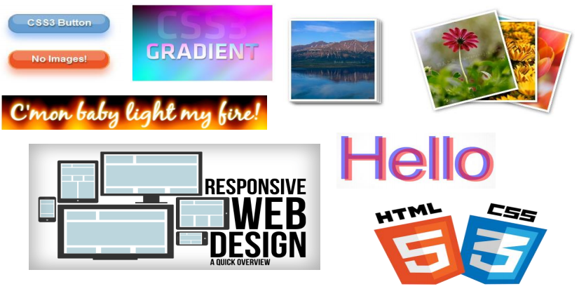
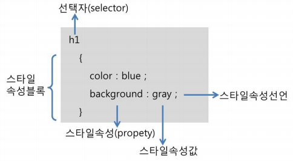
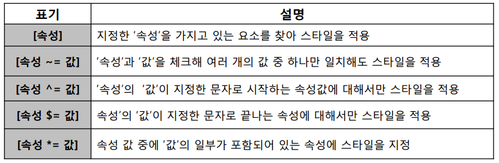
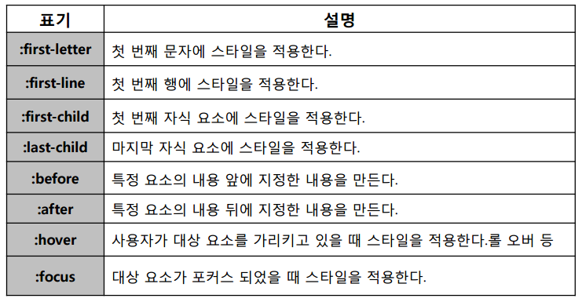
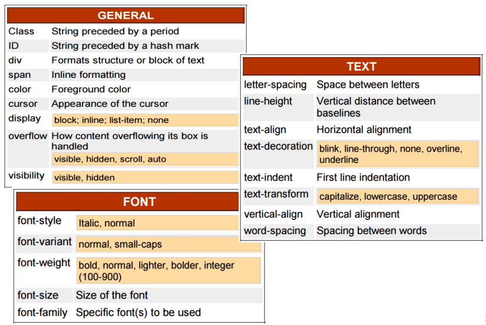
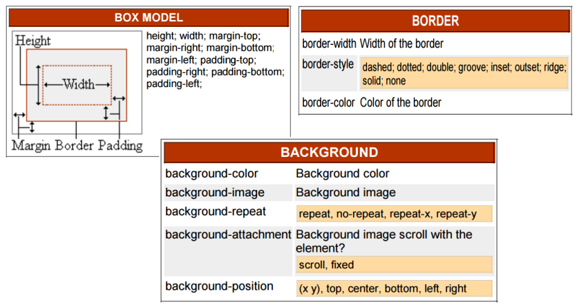
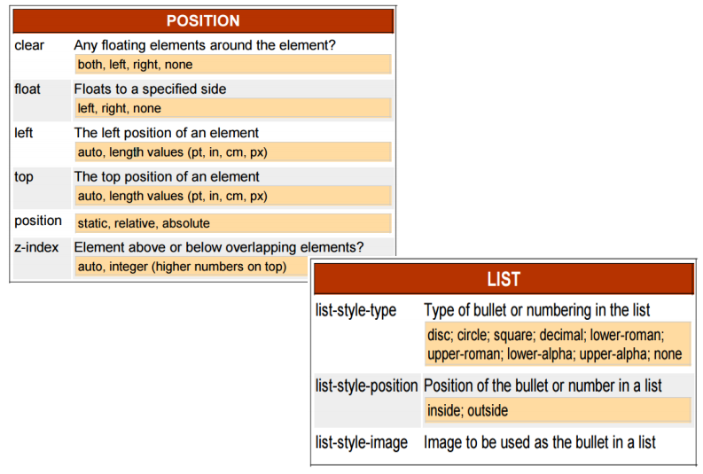

# CSS(Cascade Style Sheet)

## CSS란?

* 구조적으로 짜여진 문서(HTML, XML)에 Style(글자, 여백, 레이아웃)을 적용하기 위해 사용하는 언어이다.
* CSS는 HTML 문서의 요소에 적용되는 스타일 정의를 포함한다.
* 스타일은 요소 표시 방법 및 페이지에서의 요소 위치를 지정한다.
* W3C의 표준이며 HTML 구조는 그대로 두고 CSS파일만 변경해도 전혀 다른 웹사이트처럼 꾸밀 수 있다.

### CSS를 사용한 웹 페이지 개발

* 웹 표준에 기반한 웹 사이트를 개발할 수 있다.(페이지의 내용과 디자인을 분리)
* 클라이언트 기기에 알맞는 반응형 웹 페이지를 개발할 수 있다.
* 이미지의 사용을 최소화시켜 가벼운 웹 페이지 개발을 가능하게 한다.




### CSS 사용의 이점

* 확장성 : 표현을 더욱 다양하게 확장하거나 표현 기능의 변경 가능
* 편의성 : 훨씬 간편하게 레이아웃 등의 스타일 구성
* 재사용성 : 독립된 스타일 모듈 작성, 여러 HTML 문서에 공통으로 활용
* 생산성 : 역할 분담에 따른 전문화, 모듈 단위의 협업과 생산성의 향상


### CSS의 역사

* CSS1
  * 첫 CSS 규격은 공식 W3C 권고안이 되었으며 그 이름은 CSS1이다.
  * 1996년 12월에 출시되었다.
* CSS2
  * W3C가 개발하였으며 1998년 5월에 권고안으로 출시되었다.
* CSS3
  * 2005년 12월 5일 이후 개발 중에 있다.
  * 모듈 기반으로 개발이 진행중이며, 선택적으로 지원할 수 있다.
  * CSS3의 경우 그림자 효과, 그라데이션, 변형 등 그래픽 편집 프로그램으로 제작한 이미지를 대체할 수 있는 기능이 추가되었다. 또한 다양한 애니메이션 기능이 추가되어 플래시를 어느 정도 대체하고 있다.
  * 모든 브라우저가 CSS3를 완벽하게 지원하는 것은 아니다. 일부 기능은 브라우저에 따라 지원 방식이 달라 별도의 접두어(밴더프리픽스)를 붙여야만 사용할 수 있다.


### CSS의 작성 방법

* 인라인 방법

  * HTML 엘리먼트에 style이라는 속성으로 정의하는 방법

    ```html
    <tag style="property:value">
    ```

    

* 전역적 방법

  * `<style>` 이라는 태그에 웹 페이지의 태그들에 대한 스타일을 정의하는 방법

    ```html
    <style type="text/css">
        selector {
            property:value;
        }
    </style>
    ```

* 외부 파일 연결 방법

  * 독립된 파일(확장자.css) 을 만들어서 HTML 문서에 연결하는 방법

    ```html
    <link rel="stylesheet" type="text/css" href="style.css" />
    ```
    


### CSS 스타일 선언 형식



* CSS 선택자
  * 스타일을 적용하기 위해 대상을 선택하는 방법
* 전체 선택자
  * 페이지에 있는 모든 요소를 대상으로 스타일을 적용할 때 사용
  * 다른 선택자와 함께 모든 하위 요소에 한 번에 스타일을 적용하려고 할 때 주로 사용
    * 예) `* {margin:(); padding:()'}`
* 태그 선택자
  * 문서 안의 특정 태그에 스타일이 모두 적용됨
    * 예) `p {font-size:12px; font-family:"돋음";}`

* 클래스 선택자

  * 문서 안에서 여러 번 반복 할 스타일이면 클래스 선택자로 정의하며 . 뒤에 클래스 이름 지정
    * 예) `.redtext {color:red;}`

* id 선택자

  * 문서 안에서 한 번만 사용한다면 id 선택자로 정의하여 파운드(#) 다음에 id 이름 지정
    * 예) `#pic2 {clear:both; float:left;}`

* 하위 선택자

  * 부모 요소에 포함된 모든 하위 요소에 스타일이 적용된다.
  * 하위 선택자를 정의할 때는 상위 요소와 하위 요소를 나란히 작성한다.
    * 예) `section p {color:blue;}`

* 자식 선택자(child selector)

  * 부모 요소의 자식 요소에만 스타일이 적용된다.
    * 예) `section > p {color:blue;}`

* 인접 형제 선택자(adjacent selector)

  * 문서 구조상 같은 부모를 가진 형제 요소 중 첫 번째 동생 요소에만 스타일이 적용된다.
  * 같은 부모 요소를 가지는 요소들을 형제 관계라고 부른다.
  * 먼저 나오는 요소를 '형 요소', 나중에 나오는 요소를 '동생 요소'라고 한다.
    * 예) `h1 + p {text-decoration:underline;}`

* 형제 선택자(sibling selector)

  * 형제 요소들 중에서 모든 동생 요소들에 스타일이 적용된다.
    * 예) `h1 ~ p {text-decoration:underline;}`

* 그룹 선택자(descendant selector)

  * 같은 속성을 적용해야 할 경우 똑같은 스타일을 두 번 정의하지 않고 한 번에 묶어서 정의한다.
  * 쉼표로 선택자 구분
    * 예) `a, p {color:#ffffff;}`

* 속성 선택자(property selector)

  * 태그에 정의된 속성과 속성의 값을 가지고 대상을 정하는 선택자이다.

    

* 가상 선택자(pseudo selector)

  * 웹 문서의 소스에는 실제로 존재하지 않지만 필요에 의해 임의로 가상의 선택자를 지저앟여 사용하는 것을 말한다.

    


### CSS 주요 속성들







