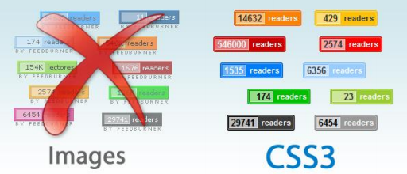
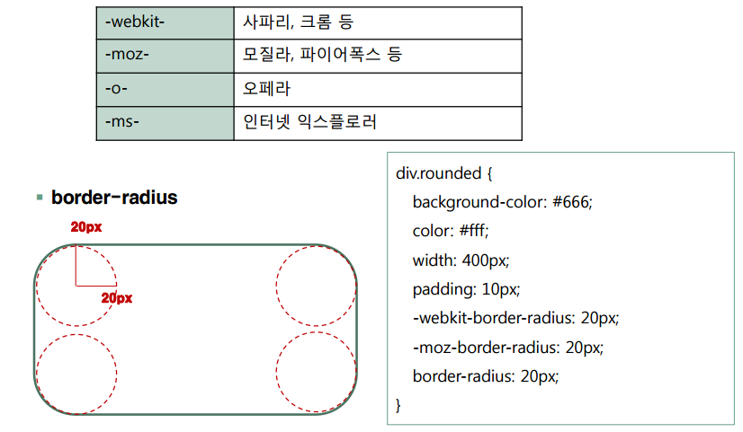
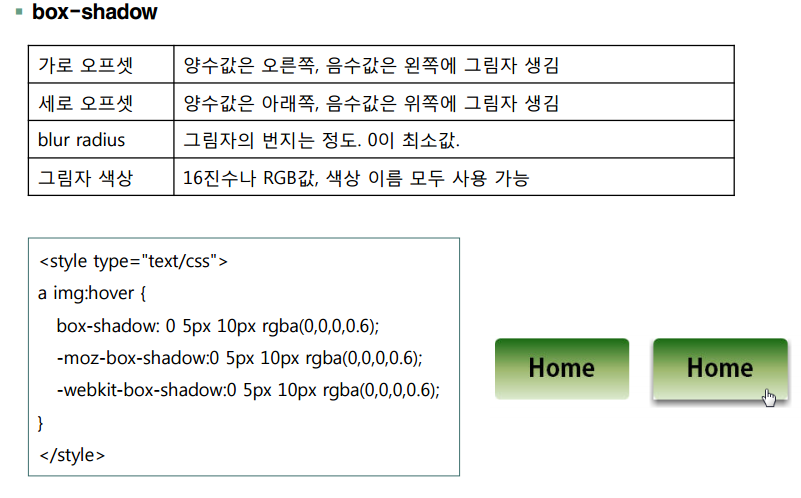
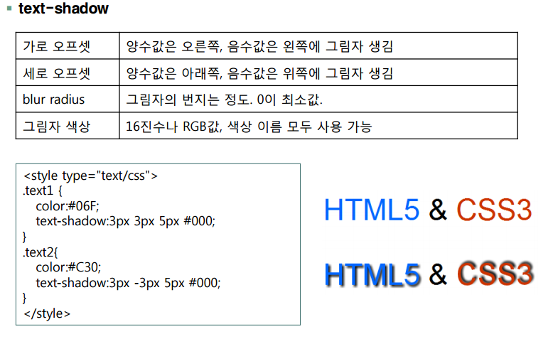
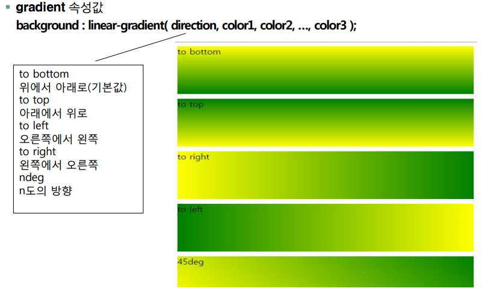
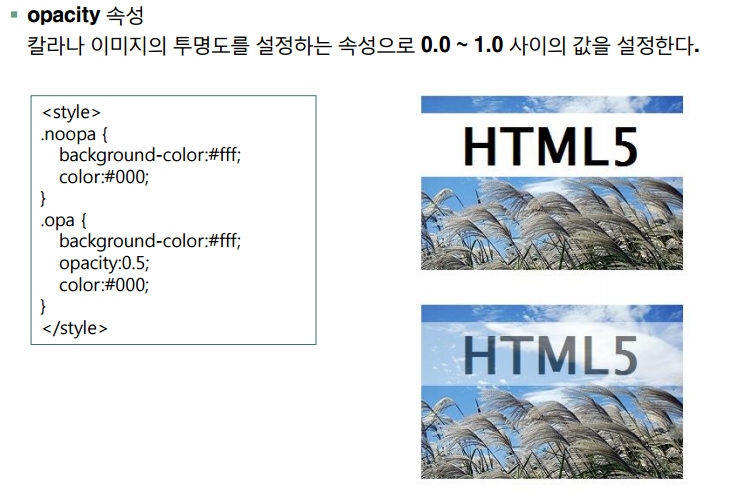

## CSS3 소개

### CSS3의 주요 기능

* 구조 선택자 지원
*  가상 선택자 지원
* 둥근 모서리의 경계선 지원
* 그라데이션 배경 지원
* 변환, 전한, 애니메이션 지원
* 글자와 박스 뒤에 그림자 효과 지원

### CSS3에서 추가된 속성들

* 새로운 CSS3 속성을 부분적으로만 지원할 수 있기 때문에 대부분의 CSS3 property를 사용하려면 property 앞에 브라우저를 식별할 수 있는 접두어를 붙여야 하는 것도 있다.

