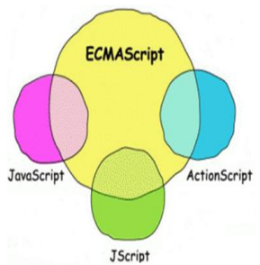
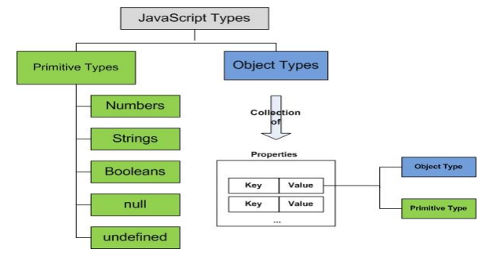

# JavaScript

## JavaScript란?

> * 브라우저에서 처리되는 프로그래밍 언어
> * HTML 만으로는 구현할 수 없는 동적인 웹 페이지 구성을 하고자 할 때 HTML 소스 안에 구현하는 프로그래밍 언어

* JavaScript는 넷스케이프 커뮤니케이션즈 코퍼레이션의 브렌던 아이크(Brendan Eich)가 처음에는 모카(Mocha)라는 이름으로, 나중에는 라이브스크립트(LiveScript)라는 이름으로 개발하였으며, 최종적으로 JavaScript라는 이름으로 발표되었다.
* JavaScript는 객체 기반의 스크립트 프로그래밍 언어이다. 이 언어는 웹 브라우저 내에서 주로 사용한다.
* 프로그래밍 언어로서 저평가 받는 시기도 있었으나 리치 콘텐츠(Rich Content)를 작성할 수 있는 AJAX(Asynchronous JavaScript + XML)의 등장으로 인해 JavaScript의 가치는 재검토되었다.
* HTML5에서 HTML5의 API로 JavaScript를 공식 채택함으로써 JavaScript는 세계에서 가장 인기 있는 프로그래밍 언어 중 하나로 자리 잡아가고 있다.


## 구문

* 변수 생성 방법, 데이터의 타입

* 연산자

* 제어문(조건문, 반복문, 분기문)

* 함수 생성과 활용

* 배열(리스트)

* 객체생성 방법:

  * ```javascript
    { k=v, k=v, ...}
    new 생성자 함수
    ```

* 이벤트 처리 구현 -> DOM 프로그래밍

* AJAX 프로그래밍

* 지도 출력하는 프로그래밍(map programming)


## ECMAScript란?

* 웹의 발전과 함께 브라우저 회사들의 과도한 경쟁으로 크로스 브라우징 구현이 어려웠으나 국제적인 표준화 단체인 ECMA(European Computer Manufacturer Association: 유럽 전자계산기 공업회)에서 착실하게 표준화를 진행하여 언어로서의 완성도를 높여 나갔다.
* 현재 대부분의 브라우저들이 지원하는 JavaScript는 ECMAScript6 표준을 따르고 있다.



## JavaScript의 활용범위

* 웹 클라이언트 개발
* 웹 서버 개발
* 어플리케이션 개발


## JavaScript의 데이터 타입

* JavaScript는 데이터 타입이 number, string, boolean, null 그리고 undefined로 구분되는 기본형 타입과 객체 타입으로 나뉜다.




* 파이썬 : True, 자바스크립트 : true, R : TRUE(T)

1. 데이터 타입
   숫자타입		: 10, 20, 3.14    : number 	
   문자(열)타입	: 'a', "a", "100"  : string
   부울타입		: true, false     : boolean
   객체타입		: { key = value, .... }
                                  new Date()             : object
   undefined타입       : undefined              : undefined

2. 변수 생성 
    var 변수명 = 값

3. 증감 연산자 : ++, --
    ++ : 증가 연산자, 단항 연산자, 주어진 변수의 값을 1 증가
    -- : 감소 연산자, 단항 연산자, 주어진 변수의 값을 1 감소

    ```javascript
    ++변수
    변수++
    
     -- 변수
     변수--
   ```

    결과 = 변수++
   
4. 주석 처리
    단일행 주석 : //
    다중행 주석 : /*  ~~~~~~ */

5. 논리연산자(&&, ||)를 이용한 조건식 처리
    boolean식 && boolean식
    boolean식 || boolean식

    if (num %2 == 0) 
        document.writeln(num+"는 짝수");

    num %2 == 0 && document.writeln(num+"는 짝수");

6. for 문
    (1) Traditional For
        for(초기식;조건식;증감식)
                반복명령들
        반복횟수를 정해놓고 반복할 때
        변수값을 정해진 룰대로 변화시키면서 반복할 때
    (2) For Each
         for(변수선언 in 배열 또는 객체)
	반복명령들
        


### JavaScript의 API

* document : write, writeln
* window : alert, confirm, prompt
* 객체를 변수에 담아서 사용
  * new Array()
  * new Date()
* console - log
* Math : class 변수, class 메서드
  * random, floor


* document.getElementsByTagName("태그명") : 배열
* document.getElementById("id속성값") : 태그객체
* document.getElementsByClassName("class속성값")


* document.querySelector("CSS선택자")
* document.querySelectorValues("CSS선택자")

